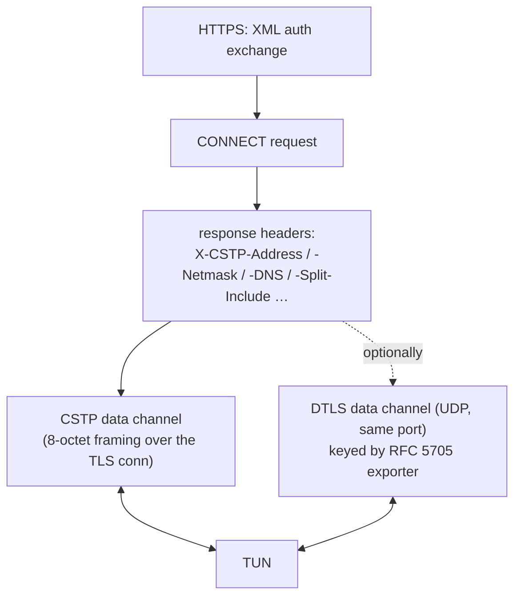

# internal/anyconnect

The Cisco AnyConnect SSL VPN protocol — the wire protocol OpenConnect and ocserv
speak. A tunnel over HTTPS (CSTP) with an optional DTLS data channel on the same
port. Both client and server roles.

## Specification

- [draft-mavrogiannopoulos-openconnect](https://datatracker.ietf.org/doc/html/draft-mavrogiannopoulos-openconnect-03) — the AnyConnect/OpenConnect protocol as reverse-engineered and written down.
- DTLS channel via [`internal/dtls`](../dtls) (PSK-NEGOTIATE, RFC 5705 exporter).

## Establishment and channels

Unlike SSTP (which negotiates addressing with a full PPP/IPCP session *inside* the
tunnel), AnyConnect configures everything in **HTTP headers** — no PPP at all:

The TLS/CSTP channel is a **complete tunnel on its own** and the fallback whenever
UDP is unavailable; DTLS is the faster optional path.

## API surface

- **Client** — `NewClient(conn, tun, ClientConfig) *Client`; `ClientConfig`,
  `DTLSParams`.
- **Server** — `NewServer(tun, ServerConfig) *Server`; `ServerConfig`,
  `TunnelConfig`.

## Implementation notes & caveats

- **Header casing is load-bearing — bypass `net/http` canonicalization.** The
  `X-CSTP-*`/`X-DTLS-*` headers must go on the wire with AnyConnect's exact casing;
  Go's `net/http` silently canonicalizes them and breaks interop. This package
  writes headers via an ordered `headerList`, not a `http.Header` map.
- **DTLS needs the RFC 5705 exporter, which needs TLS 1.3 or EMS.** If the CSTP TLS
  session offers neither, the DTLS PSK is underivable — and a **silent fallback to
  the TLS tunnel is correct**, not a failure. (The Fortinet DTLS channel differs:
  it is cert-based, not exporter-based.)
- **DTLS shares the UDP port across clients** via [`udpmux`](../udpmux) with an
  App-ID admission rule (the DTLS session ID carries the App-ID that binds a
  datagram to a CSTP session).
- Addressing comes entirely from response headers — there is no IPCP here, so the
  client applies the header-derived config directly.
