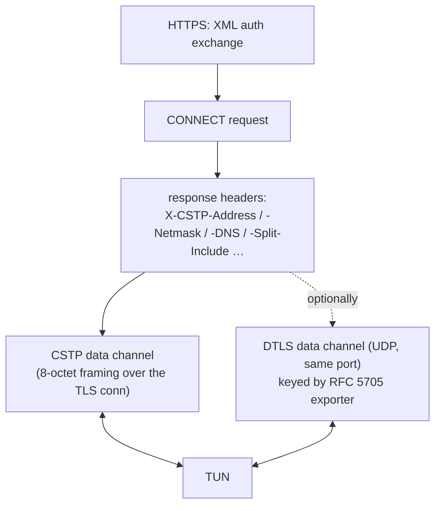

# internal/anyconnect

The Cisco AnyConnect SSL VPN protocol — the wire protocol OpenConnect and ocserv
speak. A tunnel over HTTPS (CSTP) with an optional DTLS data channel on the same
port. Both client and server roles.

## Specification

- [draft-mavrogiannopoulos-openconnect](https://datatracker.ietf.org/doc/html/draft-mavrogiannopoulos-openconnect-03) — the AnyConnect/OpenConnect protocol as reverse-engineered and written down.
- DTLS channel via [`internal/dtls`](../dtls) (PSK-NEGOTIATE, RFC 5705 exporter).

## Establishment and channels

Unlike SSTP (which negotiates addressing with a full PPP/IPCP session *inside* the
tunnel), AnyConnect configures everything in **HTTP headers** — no PPP at all:

```mermaid
flowchart TD
    XML["HTTPS: XML auth exchange"] --> CONNECT["CONNECT request"]
    CONNECT --> HDRS["response headers:<br/>X-CSTP-Address / -Netmask / -DNS / -Split-Include …"]
    HDRS --> CSTP["CSTP data channel<br/>(8-octet framing over the TLS conn)"]
    HDRS -. optionally .-> DTLS["DTLS data channel (UDP, same port)<br/>keyed by RFC 5705 exporter"]
    CSTP <--> TUN["TUN"]
    DTLS <--> TUN
```

The TLS/CSTP channel is a **complete tunnel on its own** and the fallback whenever
UDP is unavailable; DTLS is the faster optional path.

## API surface

- **Client** — `NewClient(conn, tun, ClientConfig) *Client`; `ClientConfig`,
  `DTLSParams`.
- **Server** — `NewServer(tun, ServerConfig) *Server`; `ServerConfig`,
  `TunnelConfig`.

## Implementation notes & caveats

- **Header casing is load-bearing — bypass `net/http` canonicalization.** The
  `X-CSTP-*`/`X-DTLS-*` headers must go on the wire with AnyConnect's exact casing;
  Go's `net/http` silently canonicalizes them and breaks interop. This package
  writes headers via an ordered `headerList`, not a `http.Header` map.
- **DTLS needs the RFC 5705 exporter, which needs TLS 1.3 or EMS.** If the CSTP TLS
  session offers neither, the DTLS PSK is underivable — and a **silent fallback to
  the TLS tunnel is correct**, not a failure. (The Fortinet DTLS channel differs:
  it is cert-based, not exporter-based.)
- **The client asks as well as answers.** CSTP's dead-peer detection is a
  request the peer echoes verbatim. This end always echoed and never asked, so it
  could prove itself alive to a server and learn nothing about the server —
  which matters most on DTLS, where data goes over UDP whenever it is up and a
  path that silently stops produces no read error for `dtlsReadLoop` to demote
  the channel on. `Client.Probe` sends a DPD request on whichever carrier is
  currently moving data, so it tests the path the packets take rather than the
  control connection beside it. The probe is matched by its payload, because the
  protocol carries no sequence number to match on.
- **DTLS shares the UDP port across clients** via [`udpmux`](../udpmux) with an
  App-ID admission rule (the DTLS session ID carries the App-ID that binds a
  datagram to a CSTP session).
- Addressing comes entirely from response headers — there is no IPCP here, so the
  client applies the header-derived config directly.
- **`pq-anyconnect` loses the DTLS data channel, and that is the contract rather
  than a shortcut.** `internal/dtls` is a from-scratch DTLS 1.2 with two fixed
  suites and no post-quantum key exchange at all, so leaving the UDP channel
  bound under a post-quantum name would describe the handshake while the bulk
  traffic stayed classical. The variant forces `-no-dtls`; the cost is
  head-of-line blocking on TLS. No third-party peer can verify it — openconnect
  links GnuTLS, which has no ML-KEM group — so the evidence is
  `TestInteropPQAnyConnectSelf` and nothing more. See `doc/security.md`.
