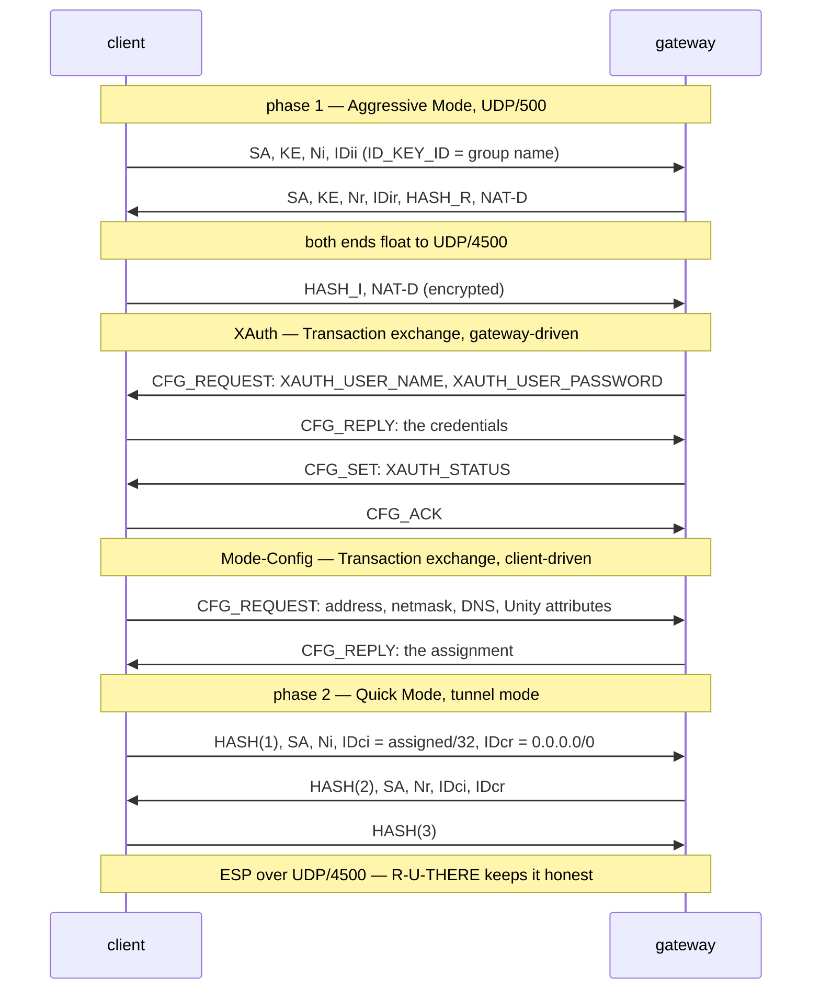

# internal/cisco

Cisco-style IPsec remote access: IKEv1 **Aggressive Mode** with a group
pre-shared key, **XAuth** for the per-user credentials, **Mode-Config** for the
address assignment, and a **tunnel-mode ESP** SA carrying bare IP over UDP.

This is the "Cisco IPSec" every desktop and phone ships a built-in client for,
and what `vpnc` and strongSwan's XAuth plugins speak.

The ISAKMP machinery is not here. It lives in
[`internal/ikev1`](../ikev1), which already carried L2TP/IPsec and now serves
both profiles: this package is the *remote-access policy* around it — the group
and user databases, the address pool, split tunnelling — and the data path, which
is [`internal/ikev2/esp`](../ikev2/esp) under
[`dataplane.Pump`](../../dataplane/pump.go) like every other datagram protocol
in veepin.

## Specification

- RFC 2407/2408/2409 — the IPsec DOI, ISAKMP, and IKEv1 (Aggressive Mode is §5.4).
- `draft-ietf-ipsec-isakmp-xauth-06` — extended authentication.
- `draft-dukes-ike-mode-cfg` — the ISAKMP Transaction exchange and Mode-Config.
- RFC 3706 — dead-peer detection.
- RFC 3947/3948 — NAT traversal, and UDP-encapsulated ESP.
- RFC 4303 — the ESP data path itself.

The Cisco Unity attributes (banner, default domain, split-include) have no
specification; their numbers and layouts come from `vpnc` and strongSwan's
`unity` plugin, against which veepin interoperates.

## The exchange

Two credentials in sequence is the whole point of the design: the group key
authenticates phase 1 and is shared by everyone in the group, and the user's own
password travels afterwards *inside* phase-1 encryption. Aggressive Mode exposes
the identity in the clear, and the identity it exposes is the group name, not
the user's.

## API surface

- **Roles** — `NewClient`, `Client` (with `Handshake`, `Wait`, `Close`, `Probe`),
  `NewServer`, `Server` (with `Serve`, `Close`).
- **Configuration** — `ClientConfig`, `ServerConfig`, `NetConfig`.
- **Data path** — `NewTunnel`, `Tunnel` (a `dataplane.Tunnel`, and a
  `dataplane.PaddingTunnel`).
- `DefaultIKEPort`, `DefaultNATTPort`, `ErrAuth`.

## Implementation notes & caveats

- **Aggressive Mode is not identity-protecting.** Message 1 carries the group
  name in the clear and message 2 carries a hash a passive observer can attack
  offline against a weak group key. Every deployment of this protocol has that
  property — it is what strongSwan makes you write
  `charon.i_dont_care_about_security_and_use_aggressive_mode_psk = yes` to enable
  — so the group key must be treated as a high-entropy secret, not a memorable
  one. `doc/security.md` says so at greater length.
- **XAuth is a password over an authenticated channel, nothing more.** The
  channel is phase-1 encrypted, so the password is not exposed to a passive
  observer; but anyone holding the group key can stand up a gateway and collect
  user passwords. Again: a property of the protocol, and the reason the
  challenge/response XAuth types are refused with a clear error rather than
  half-implemented.
- **NAT-T is required, not negotiated away.** The data path is a userspace UDP
  socket with no raw-IP fallback, so a peer unwilling to UDP-encapsulate ESP
  cannot be talked to at all; `internal/ikev1` refuses it during phase 1 rather
  than completing an exchange whose packets would all be dropped.
- **The phase-2 selectors are the assigned address against everything.** IDci is
  the client's Mode-Config address as an `ID_IPV4_ADDR`, IDcr is `0.0.0.0/0` as
  an `ID_IPV4_ADDR_SUBNET`. That is the shape a gateway's policy is written in,
  and it is why Mode-Config must run before Quick Mode.
- **Split-include is advice, not a filter.** The gateway's `UNITY_SPLIT_INCLUDE`
  networks tell a client what to route *into* its TUN. Once a packet is at the
  TUN it goes to the one tunnel there is — applying the list a second time would
  silently drop traffic the caller had deliberately routed in.
- **One pump, many peers, on the server.** Each client's SA becomes one
  `dataplane.Tunnel` whose route is its assigned `/32`; inbound demultiplexes by
  ESP SPI and TUN egress by inner destination. There is no per-peer TUN and no
  per-peer goroutine on the data path.
- **No rekey.** Phase-1 and phase-2 lifetimes are proposed (one hour) but never
  acted on: neither side rekeys, so a long-lived tunnel keeps its original keys.
  Dead-peer detection runs, so a gateway that *does* expire the SA is noticed
  promptly rather than blackholing traffic.
- **IPv4 only.** IKEv1's identities and traffic selectors are IPv4 throughout in
  this profile, so the facade refuses an IPv6-only gateway with the reason rather
  than failing later in the exchange.

## Tests

- `e2e_test.go` — a client and a gateway over loopback UDP: the full exchange,
  traffic both ways, shaped and unshaped, dead-peer detection, and the three ways
  a credential is refused.
- `datapath_test.go` — the per-packet allocation guard and the IKE/ESP demux.
- The ISAKMP-level tests — Aggressive Mode both roles, the Transaction codec, the
  DPD notification — live in [`internal/ikev1`](../ikev1).
