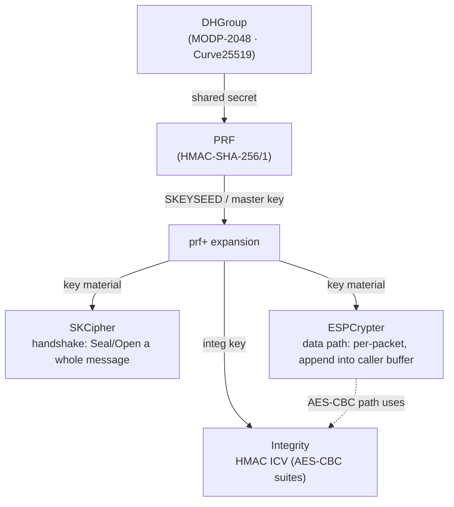

# internal/cryptoutil

Protocol-agnostic cryptographic primitives shared by every VPN transport in the
tree: Diffie-Hellman groups, keyed PRFs and `prf+` expansion, integrity
transforms, and the two cipher shapes a VPN needs — a **handshake** cipher
(`SKCipher`, whole-message seal/open) and a **data-path** cipher (`ESPCrypter`,
per-packet, allocation-conscious).

Nothing here knows about IKEv2 or any IANA transform-ID registry. Mapping a
negotiated transform ID onto one of these primitives is a protocol package's job
(for IKEv2, [`internal/ikev2/transform`](../ikev2/transform)), which keeps this
layer reusable by WireGuard, OpenVPN, Nebula, and the rest.

## Specifications

| Primitive | Reference |
|-----------|-----------|
| MODP-2048 Diffie-Hellman (group 14) | [RFC 3526](https://www.rfc-editor.org/rfc/rfc3526) |
| Curve25519 / ECDH | [RFC 7748](https://www.rfc-editor.org/rfc/rfc7748) |
| HMAC | [RFC 2104](https://www.rfc-editor.org/rfc/rfc2104) |
| `prf+` key expansion | [RFC 7296 §2.13](https://www.rfc-editor.org/rfc/rfc7296#section-2.13) |
| AES-GCM AEAD | [RFC 5116](https://www.rfc-editor.org/rfc/rfc5116), [RFC 4106](https://www.rfc-editor.org/rfc/rfc4106) |
| AES-CBC + HMAC | [RFC 3602](https://www.rfc-editor.org/rfc/rfc3602) |
| ChaCha20-Poly1305 / XChaCha20 | [RFC 8439](https://www.rfc-editor.org/rfc/rfc8439) |
| BLAKE2s (hash + keyed MAC) | [RFC 7693](https://www.rfc-editor.org/rfc/rfc7693) |

## How the primitives compose

The pieces here are the links of a key schedule; a protocol chains them from a
raw DH exchange down to the two ciphers that actually move packets.

## API surface

- **Diffie-Hellman** — `DHGroup` interface; `NewMODP2048()` (group 14),
  `NewECDH(curve, stripPointPrefix)` (Curve25519 and the NIST curves; the strip
  flag drops the `0x04` uncompressed-point prefix that IKEv2 wire format omits).
- **PRF / expansion** — `PRF` via `NewHMACPRF(newHash)`; carries the `prf+`
  expansion used to stretch a seed into arbitrary key material.
- **Integrity** — `Integrity` via `NewHMACIntegrity(newHash, keyLen, icvLen)`;
  the truncated-HMAC ICV for the AES-CBC AEAD-by-composition suites.
- **Handshake cipher** — `SKCipher` (`NewAESGCMSKCipher`,
  `NewChaCha20Poly1305SKCipher`, `NewAESCBCSKCipher`), sealing/opening a complete
  IKE `SK` payload. Rebuilds its AEAD per call — fine for the handshake, wrong
  for the data path (see caveats). AES-GCM and ChaCha20-Poly1305 (RFC 7634) share
  one generic AEAD implementation: identical framing (4-octet salt, 8-octet IV,
  16-octet tag), differing only in the AEAD constructor and key length.
- **Data-path cipher** — `ESPCrypter` (`NewAESGCMESPCrypter`,
  `NewChaCha20Poly1305ESPCrypter`, `NewAESCBCESPCrypter`): constructs its keyed
  AEAD **once**, then seals/opens by appending into a caller-supplied buffer.
- **AEAD constructors + hashes** — `NewChaCha20Poly1305`, `NewXChaCha20Poly1305`,
  `NewBLAKE2s`, `NewBLAKE2s128MAC`, `NewBLAKE2s256MAC` (for WireGuard/Nebula Noise).
- **Constant-time compare** — `SecretEqual`.

## Implementation notes & caveats

- **`SKCipher` vs `ESPCrypter` is the central distinction.** `SKCipher` rebuilds
  `aes.NewCipher`/`cipher.NewGCM` on every call — negligible a few times per
  handshake, ruinous per packet. `ESPCrypter` prepares the keyed AEAD once and is
  the type the data plane must use. Never seal packets with an `SKCipher`.
- **`ESPCrypter` is single-goroutine per direction.** It is designed to be driven
  by one goroutine per SA direction (matching the pump). It is not safe for
  concurrent seals on one direction.
- **`stripPointPrefix`** exists because IKEv2's KE payload carries a raw
  coordinate while Go's `crypto/ecdh` wants the `0x04`-prefixed uncompressed form;
  the flag reconciles the two so the same `DHGroup` serves both wire formats.
- **MODP-2048 is ~70× slower than Curve25519** for a shared-secret computation
  (~3.9 ms vs ~53 µs — see the root `README.md` benchmarks). It exists for
  interop; curves are preferred wherever a peer allows.
- Protocol-specific transform-ID → primitive mapping lives **outside** this
  package on purpose; do not add IANA registry knowledge here.
