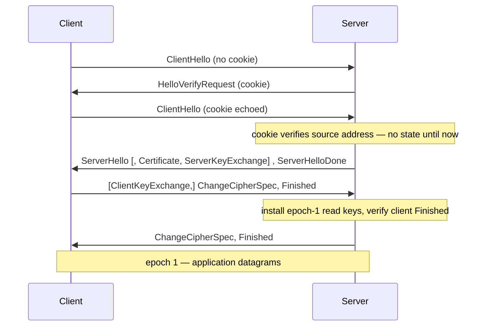

# internal/dtls

The subset of DTLS 1.2 the datagram VPN channels need, in both client and server
roles. Two handshake shapes:

- **PSK + AES-GCM** — AnyConnect's data channel, where the pre-shared key comes
  from the already-established CSTP/TLS session via an RFC 5705 exporter.
- **ECDHE-ECDSA + AES-GCM** — Fortinet's data channel, a certificate-based key
  exchange (Fortinet gateways present an ECDSA cert).

Deliberately **not** a general-purpose DTLS stack: only AEAD suites (no CBC/MAC,
so no padding-oracle surface), built on the standard library's AES-GCM/HMAC/SHA-2.

## Specifications

- [RFC 6347](https://www.rfc-editor.org/rfc/rfc6347) — DTLS 1.2 (record layer, flights, retransmission, cookie).
- [RFC 4279](https://www.rfc-editor.org/rfc/rfc4279) — PSK cipher suites; [RFC 5705](https://www.rfc-editor.org/rfc/rfc5705) — keying-material exporter (AnyConnect PSK).
- [RFC 5289](https://www.rfc-editor.org/rfc/rfc5289) — ECDHE-ECDSA AES-GCM suites (Fortinet).

## Handshake flights

DTLS runs over UDP, so it adds a stateless cookie (anti-amplification) and flight
retransmission on top of the TLS handshake:

## API surface

- `Client(conn net.Conn, cfg Config) (*Conn, error)` / `Server(conn, cfg)`.
- `Config` — `PSK`, `Certificate`, `RootCAs`, `InsecureSkipVerify`,
  `HandshakeTimeout`.
- `Conn` — `net.Conn`; `Read` returns `io.EOF` on a decrypted `close_notify`.
- Peek helpers for the [`udpmux`](../udpmux) admission callback:
  `IsClientHello(datagram)`, `ClientHelloSessionID(datagram)`.

## Implementation notes & caveats

- **The coalesced-final-flight bug is fixed here — don't reintroduce it.** GnuTLS
  (hence openconnect) packs ClientKeyExchange + ChangeCipherSpec + Finished into
  one datagram. The server reads flight 4 in two passes with key installation
  between them, so the epoch-1 Finished arrives *before* its keys exist.
  Undecryptable records are now **stashed and replayed** (`deferred` records,
  `drainDeferred`) after the keys install, rather than dropped. Regression-tested
  network-free by `TestECDHEServerAcceptsCoalescedFinalFlight`.
- **HelloVerifyRequest is mandatory server-side** — no per-peer state is allocated
  until the client echoes a valid source-bound cookie (DTLS's anti-amplification
  defence). Pairs with [`udpmux`](../udpmux)'s admission model.
- **AnyConnect needs the RFC 5705 exporter, which requires TLS 1.3 or EMS.** If the
  CSTP/TLS session offers neither, the PSK is underivable and a silent fallback to
  the TLS tunnel is the correct behaviour — see the AnyConnect docs.
- **The replay window is per-epoch** (RFC 6347), distinct from every other window
  in the tree; not the shared [`internal/replay`](../replay).
- The package doc comment predates the ECDHE work and mentions only PSK; the
  cert-based path is real (see `Config.Certificate`/`RootCAs` and the ECDHE tests).
