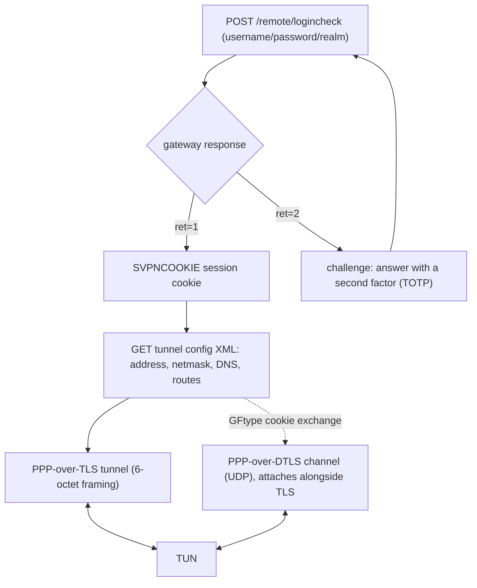

# internal/fortinet

The FortiOS SSL VPN protocol: the HTTPS authentication/configuration exchange, the
PPP-over-TLS data tunnel, an optional PPP-over-DTLS data channel, and the `ret=2`
two-factor challenge. Transport-light on purpose — PPP link setup (LCP/IPCP) is
[`internal/ppp`](../ppp), and the carrier is an ordinary TLS (or DTLS) connection.

## Specification

FortiOS SSL VPN has no public RFC; the wire behaviour is defined by the gateway and
by `openconnect`'s Fortinet support, against which veepin interoperates. The DTLS
channel uses [`internal/dtls`](../dtls) (cert-based ECDHE-ECDSA); 2FA codes use
[`internal/otp`](../otp).

## Login, tunnel, and the optional DTLS channel

## API surface

- **Auth/config** — `BuildLoginForm`, `BuildLoginSuccess`, `BuildConfigXML`,
  `TunnelRequest`, `PathLoginCheck`.
- **2FA** — `Challenge`, `ChallengeRequest`/`ParseChallengeForm`,
  `BuildChallengeForm`, `BuildChallengeResponse`, `IsChallengeForm`, `ErrChallenge`.
- **TLS framing** — `EncodeFrame`, `ParseFrame`, `ReadFrame`, `ErrShortFrame`.
- **DTLS channel** — `DialDTLS`, `BuildDTLSClientHello`/`ParseDTLSClientHello`,
  `BuildDTLSServerHello`/`ParseDTLSServerHello`, `ErrNoDTLS`.
- `ErrAuth`.

## Implementation notes & caveats

- **The DTLS channel is cert-based and attaches *alongside* the TLS tunnel.** It is
  not a replacement: both carriers move packets for the same session. **Detaching a
  DTLS carrier loses in-flight datagrams by design** — the peer can't know until its
  read loop sees the close — so tests assert eventual recovery, not zero loss. See
  [[fortinet-dtls-channel]].
- **The GFtype ClientHello cookie requires a trailing NUL.** Without it there were
  two encodings for one cookie (a fuzz crash); `ParseDTLSClientHello` now requires
  the NUL terminator.
- **The `ret=2` challenge form must preserve field order — don't use `url.Values`.**
  It sorts keys, and Fortinet's `ftm_push` flow requires `magic` to be **last**;
  the form is hand-built (`challengeEcho` with `magic` last). See [[fortinet-ssl-vpn]].
- **openconnect's `--token-secret` treats a bare value as raw ASCII** — a base32
  TOTP secret needs the `base32:` prefix, or the generated codes won't match.
- **The client direction has no open-source gateway to test against** with a full
  data path; the independent-implementation proof is real openconnect *client* ↔
  veepin server (see the interop-matrix note in the root README). RSA-key gateways
  fall back to TLS-only since the DTLS channel needs an ECDSA cert.
