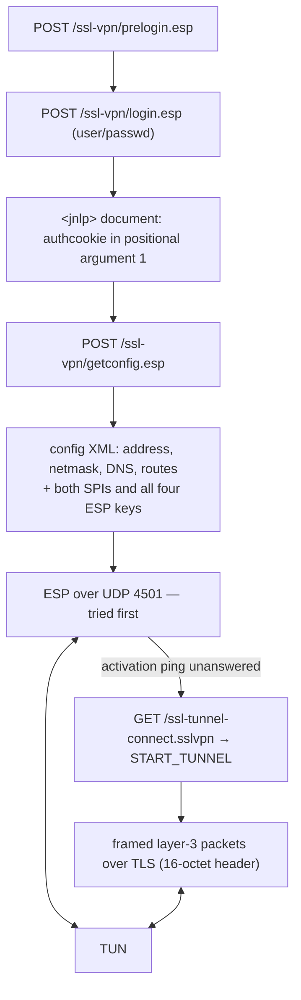

# internal/gp

The Palo Alto Networks GlobalProtect SSL VPN: the HTTPS authentication and
configuration exchange, an RFC 4303 ESP data path over UDP, and a framed layer-3
tunnel over TLS as the fallback.

It reuses the IPsec machinery rather than the PPP machinery, because there is no
PPP here and no key exchange either: the gateway generates both SPIs and all four
ESP keys and hands them to the client **inside the configuration XML**. The data
path is then [`internal/ikev2/esp`](../ikev2/esp) with those keys plugged in, and
[`internal/cryptoutil`](../cryptoutil) underneath it.

## Specification

GlobalProtect has no public specification. The wire behaviour is defined by the
gateway and by `openconnect`'s `--protocol=gp` support (and its
`PAN_GlobalProtect_protocol_doc.md`), against which veepin interoperates.

## Login, configuration, and the two data paths

The order is forced by the protocol. Opening the SSL tunnel invalidates the SPIs
the same configuration handed out, so ESP is tried **first** and the fallback runs
in that direction only — a client that opened the tunnel first would have nothing
left to fall back to.

## API surface

- **Auth/config** — `Login`, `Logout`, `BuildLoginForm`/`ParseLoginForm`,
  `BuildLoginResponse`/`ParseLoginResponse`, `BuildConfigXML`/`ParseConfigXML`,
  `BuildPreloginResponse`/`ParsePreloginResponse`, `TunnelRequest`,
  `ParseTunnelRequest`, `ReadTunnelStart`, the `Path*` constants.
- **SSL framing** — `EncodeFrame`, `EncodeKeepalive`, `ParseFrame`, `ReadFrame`,
  `EtherTypeFor`, `ErrShortFrame`, `ErrBadMagic`.
- **ESP** — `ESPConfig`, `GenerateESP`, `SelectESPAlgos`, `(*ESPConfig).NewSA`,
  `Tunnel` (a `dataplane.Tunnel`), `BuildActivationPing`, `IsActivationPing`,
  `ActivationReply`, `DefaultESPPort`.
- **Roles** — `RunESP`, `RunSSL`, `Client` (with `Probe`), `NewServer`, `Server`
  (an `http.Handler`, plus `RunTUN`, `EnableESP`, `ServeESP`).
- `ErrAuth`, `ErrSAML`.

## Implementation notes & caveats

- **The keys travel in the configuration document.** There is no key exchange and
  no forward secrecy: whoever can read a session's getconfig response can read
  that session's traffic for its whole life. That is Palo Alto's design, not a
  shortcut taken here — but it is the reason this protocol is the weakest of the
  IPsec-carrying ones in this tree, and `doc/security.md` says so.
- **Only CBC suites are supported** (`aes-128-cbc`/`aes-256-cbc` with
  `sha1`/`sha256`). Real gateways answer with `aes-128-cbc` essentially always.
  The GCM spellings a client may advertise have nowhere in this document to carry
  the four-octet salt RFC 4106 requires — there is one key element per direction
  and no salt field — so they are refused with a clear error rather than keyed by
  an invented convention that would interoperate with nothing.
- **The activation exchange is not optional.** A gateway ignores ESP from a client
  it has not heard from, so the client sends ICMP echo requests carrying the fixed
  16-octet marker `monitor\0\0pan ha ` and waits for anything back. Silence is the
  ordinary signal that UDP is blocked, and it is what triggers the fallback; the
  whole exchange is bounded by `espActivationTimeout`.
- **The activation ping is addressed to the gateway's *outer* address**, which is
  not a destination the tunnel should route traffic to. The server answers these
  itself in `handleESP` rather than writing them to the shared TUN.
- **The login response is positional.** It is a Java Web Start `<jnlp>` document
  whose `<argument>` elements have meaning by index alone; argument 1 is the
  authentication cookie and argument 12 must read `tunnel`. Both roles build and
  read it by position for that reason.
- **The two data paths coexist across clients, not within one.** A gateway serves
  SSL-tunnel and ESP clients at the same time over one TUN, which is why there is
  one TUN read loop (`RunTUN`) and one routing table from inner address to
  whichever kind of link that client ended up on.
- **Shaping works on both paths without client support.** On ESP it is RFC 4303
  §2.7 traffic-flow confidentiality; on the SSL tunnel it is trailing bytes after
  the inner packet, which every IP stack trims by the packet's own header length
  (Linux does it in `ip_rcv`) — the same property `dataplane.TrimToIP` relies on.
- **No SAML.** A gateway configured for browser-based authentication is detected at
  prelogin and reported as `ErrSAML`, so the failure does not look like a wrong
  password.
- **`pq-gp` keeps the ESP data path, unlike the DTLS protocols.** The ESP keys
  are derived and delivered inside the TLS control channel, so hardening that
  channel is what protects them; ESP's own AES-GCM is symmetric and is not a
  quantum-broken primitive. DTLS differs because it negotiates its *own* key
  exchange, which `internal/dtls` has no post-quantum spelling for. There is no
  third-party peer — openconnect links GnuTLS — so `TestInteropPQGPSelf` is the
  whole of the evidence.
