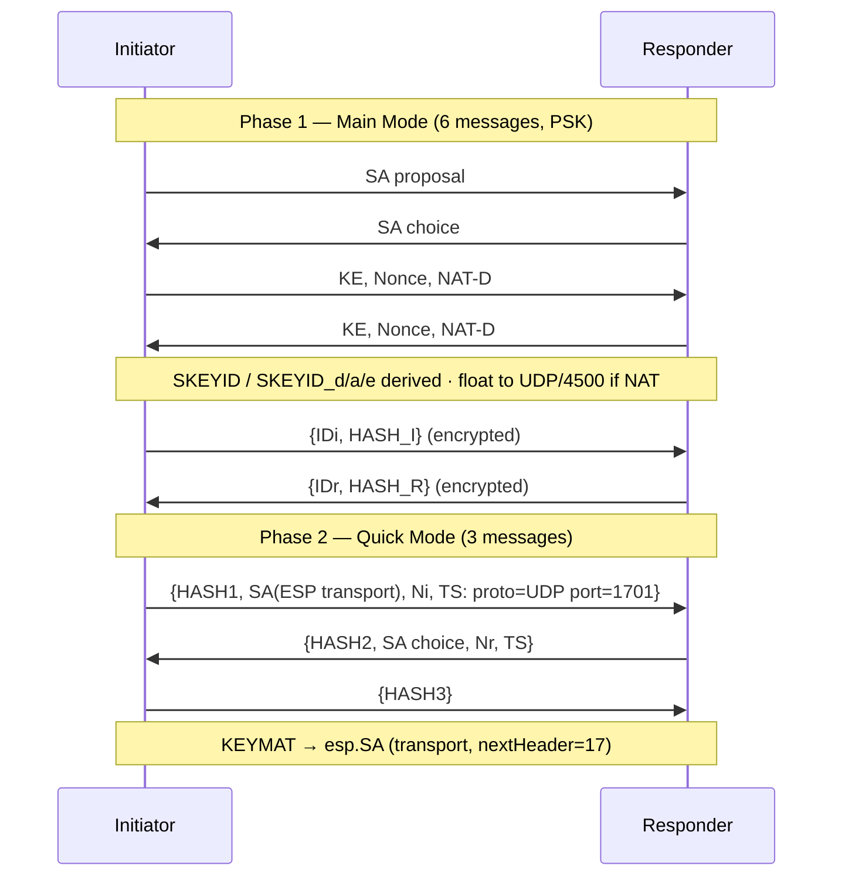

# internal/ikev1

The IKEv1 (ISAKMP/Oakley) key exchange that keys the IPsec transport-mode SA under
L2TP/IPsec. A Main Mode initiator and responder with PSK authentication, Quick Mode
to negotiate an ESP transport SA for UDP/1701, and NAT-T so ESP floats to UDP/4500.

This is what every native-OS L2TP/IPsec client speaks (Windows, macOS, iOS,
Android) and what a stock xl2tpd/strongSwan deployment uses — which is why
L2TP/IPsec needs IKEv1, not the IKEv2 the rest of veepin runs.

## Specifications

- [RFC 2408](https://www.rfc-editor.org/rfc/rfc2408) — ISAKMP; [RFC 2409](https://www.rfc-editor.org/rfc/rfc2409) — IKE (Main/Quick Mode); [RFC 2407](https://www.rfc-editor.org/rfc/rfc2407) — IPsec DOI.
- [RFC 3947](https://www.rfc-editor.org/rfc/rfc3947) / [RFC 3948](https://www.rfc-editor.org/rfc/rfc3948) — NAT-T detection and UDP-encapsulated ESP.

Primitives (MODP DH, HMAC PRF, AES-CBC) come from [`cryptoutil`](../cryptoutil);
the ESP data path is [`ikev2/esp`](../ikev2/esp) in **transport** mode.

## Main Mode + Quick Mode

## API surface

- `NewSession(Config) *Session` — drives either role; `Role` (`Initiator`/`Responder`).
- `Config`, `Handler`, `Result` (the keyed ESP transport SA parameters).
- `InitiatorCookie(msg) ([8]byte, bool)` — demux by ISAKMP initiator cookie.

## Implementation notes & caveats

- **Phase-1 crypto is byte-exact or nothing.** SKEYID derivation and the CBC IV
  chaining across Main Mode messages must match strongSwan exactly, or the
  encrypted ID/HASH payloads won't decrypt. This is the finicky part — pinned by
  known-answer tests and interop.
- **Quick Mode traffic selectors are pinned to `proto=UDP, port=1701`** — the SA
  protects L2TP, not arbitrary traffic. The resulting KEYMAT feeds
  `esp.SA` in **transport** mode with `nextHeader=17` (UDP), unlike the IKEv2
  tunnel-mode path.
- **NAT-T is forced deterministic between containers.** NAT-D payloads detect NAT;
  where same-L2 peers wouldn't, ESP is still UDP-encapsulated on 4500 so framing is
  predictable (mirroring the IKEv2 data path).
- **Only PSK auth, MODP-2048 + AES-CBC-256 + SHA-256** by default, to keep the
  proposal small; widen only if a stock client insists on group 2 / SHA1.
