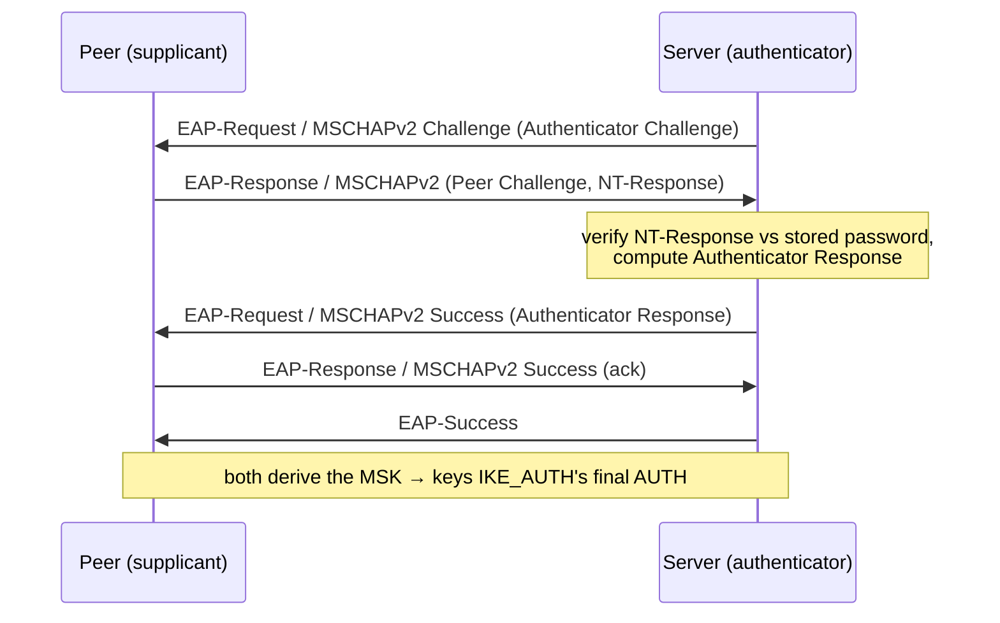

# internal/ikev2/eap

The minimal EAP machinery for IKEv2 username/password authentication: the EAP
packet format and the EAP-MSCHAPv2 method. Driven by [`ike`](../ike) during the
`IKE_AUTH` exchange.

## Specifications

- [RFC 3748](https://www.rfc-editor.org/rfc/rfc3748) — EAP packet format.
- [RFC 2759](https://www.rfc-editor.org/rfc/rfc2759) — Microsoft PPP CHAP Extensions v2 (MSCHAPv2).
- [RFC 3079](https://www.rfc-editor.org/rfc/rfc3079) — deriving MPPE/MSK keys from MSCHAPv2.
- [RFC 1320](https://www.rfc-editor.org/rfc/rfc1320) — MD4 (the NT-hash digest; bundled, see caveats).

## EAP-MSCHAPv2 exchange

A three-way challenge/response inside EAP, then a Success the peer must
acknowledge:

## API surface

- **Packet codec** — `Packet`, `Parse`, `Code` (request/response/success/failure),
  `Type` (`TypeIdentity`, MSCHAPv2), `SuccessResponseData()`.
- **Server** — `NewServer(lookup CredentialLookup, serverName)` drives the method
  server-side and yields a `Result`; `ClientChallenge`/`ParseChallenge` for the
  supplicant side.
- **Credential stores** — `CredentialLookup` func type;
  `LoadFileStore(path)` (an `htpasswd`-style user file) and
  `NewMemoryStore(map)`.

## Implementation notes & caveats

- **MD4 is bundled, not imported.** MSCHAPv2 mandates the legacy NT password hash,
  which is MD4 — absent from the Go standard library. A compact RFC 1320 MD4 lives
  here to keep the module dependency-free. **It is used only for the NT-hash
  construction the protocol requires; it is not a general-purpose hash** and must
  not be reused as one.
- **MSCHAPv2 is legacy and weak by modern standards** — it exists for interop with
  the native OS supplicants and strongSwan's EAP path, protected by the outer
  IKE SA's encryption. It is not offered as a strong primitive.
- The server verifies the NT-Response and computes the Authenticator Response the
  peer checks; both sides derive the **MSK**, which [`ike`](../ike) folds into the
  final `IKE_AUTH` signature — so a wrong password fails the *IKE* AUTH, not just EAP.
