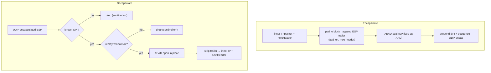

# internal/ikev2/esp

A minimal **userspace** ESP data path with UDP encapsulation. It protects and
opens IP payloads under the keys [`ike`](../ike) negotiates for a Child SA. This
is a userspace demonstration data path — it does **not** touch the kernel IPsec
stack. It is also the tree's most heavily optimized hot path (see the root
`README.md` benchmarks).

## Specifications

- [RFC 4303](https://www.rfc-editor.org/rfc/rfc4303) — ESP (packet format, ICV, anti-replay §3.4.3).
- [RFC 3948](https://www.rfc-editor.org/rfc/rfc3948) — UDP encapsulation of ESP (NAT-T).
- [RFC 4106](https://www.rfc-editor.org/rfc/rfc4106) — AES-GCM in ESP; [RFC 3602](https://www.rfc-editor.org/rfc/rfc3602) — AES-CBC in ESP.

## Packet paths

`nextHeader` is the seam that makes this reusable: `4` (IP-in-IP) for the IKEv2
tunnel; **`17` (UDP)** for L2TP transport mode, where the SA protects L2TP/UDP
rather than a raw inner IP packet.

## API surface

- `SA` — one directional pair: `SPIOut`/`SPIIn`, `Out`/`In` `Transform`s.
  - `Encapsulate(inner, nextHeader) ([]byte, error)`
  - `Decapsulate(pkt) (inner []byte, nextHeader uint8, error)`
  - `ResetReplayWindow()` — for a rekey that restarts sequence numbers.
- `Transform` — the per-direction keyed cipher (built via
  [`transform.ESPCrypter`](../transform)).

## Implementation notes & caveats

- **This is the allocation-critical path.** `Encapsulate`/`Decapsulate` append
  into caller buffers and both AES-GCM paths are **one allocation per packet**
  (the returned buffer). `TestDataPathAllocationsGCM` guards this via
  `AllocsPerRun`; don't regress it. Key traps: passing a stack array as AEAD AAD
  or nonce escapes it to the heap (write the header into the output buffer and
  reuse that prefix as AAD instead), and reject paths use **pre-allocated sentinel
  errors** so a flood of bad datagrams allocates nothing.
- **One `SA` is driven by one goroutine per direction** (matching the pump). The
  in-place open and reused nonce/scratch buffers assume this; concurrent opens on
  one direction are unsafe. Multi-client scaling is across SAs/cores
  (`BenchmarkESPDecapParallel`).
- **The replay window here is RFC 4303's own** — not the shared
  [`internal/replay`](../../replay). That is deliberate: 4303 mandates specific
  size and sequence handling, and this implementation is pinned by the strongSwan
  interop cell.
- **AES-CBC+HMAC is ~10× slower than GCM** on this path (see benchmarks), which is
  why GCM is the default; CBC exists for older peers.
