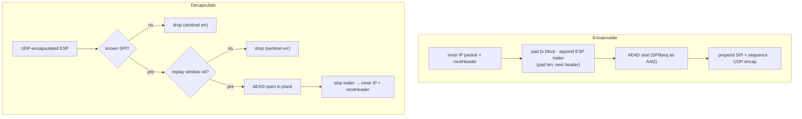

# internal/ikev2/esp

A minimal **userspace** ESP data path with UDP encapsulation. It protects and
opens IP payloads under the keys [`ike`](../ike) negotiates for a Child SA. This
is a userspace demonstration data path — it does **not** touch the kernel IPsec
stack. It is also the tree's most heavily optimized hot path (see the root
`README.md` benchmarks).

## Specifications

- [RFC 4303](https://www.rfc-editor.org/rfc/rfc4303) — ESP (packet format, ICV, anti-replay §3.4.3).
- [RFC 3948](https://www.rfc-editor.org/rfc/rfc3948) — UDP encapsulation of ESP (NAT-T).
- [RFC 4106](https://www.rfc-editor.org/rfc/rfc4106) — AES-GCM in ESP; [RFC 3602](https://www.rfc-editor.org/rfc/rfc3602) — AES-CBC in ESP.

## Packet paths

```mermaid
flowchart TD
    subgraph Encapsulate
      IN["inner IP packet + nextHeader"] --> PAD["pad to block · append ESP trailer<br/>(pad len, next header)"]
      PAD --> SEAL["AEAD seal (SPI‖seq as AAD)"]
      SEAL --> WRAP["prepend SPI + sequence · UDP-encap"]
    end
    subgraph Decapsulate
      RX["UDP-encapsulated ESP"] --> SPI{known SPI?}
      SPI -->|no| DROP1["drop (sentinel err)"]
      SPI -->|yes| RP{replay window ok?}
      RP -->|no| DROP2["drop (sentinel err)"]
      RP -->|yes| OPEN["AEAD open in place"]
      OPEN --> STRIP["strip trailer → inner IP + nextHeader"]
    end
```

`nextHeader` is the seam that makes this reusable: `4` (IP-in-IP) for the IKEv2
tunnel; **`17` (UDP)** for L2TP transport mode, where the SA protects L2TP/UDP
rather than a raw inner IP packet.

## API surface

- `SA` — one directional pair: `SPIOut`/`SPIIn`, `Out`/`In` `Transform`s.
  - `Encapsulate(inner, nextHeader) ([]byte, error)`
  - `AppendEncapsulated(dst, inner, nextHeader, minInner) ([]byte, error)` —
    the same, appended to a caller's buffer; what `dataplane.AppendTunnel` uses.
  - `Decapsulate(pkt) (inner []byte, nextHeader uint8, error)` — **opens in
    place**: `inner` is a subslice of `pkt`, which is overwritten.
  - `ResetReplayWindow()` — for a rekey that restarts sequence numbers.
- `Transform` — the per-direction keyed cipher (built via
  [`transform.ESPCrypter`](../transform)).

## Implementation notes & caveats

- **This is the allocation-critical path, and it allocates nothing.**
  `Decapsulate` opens in place and `AppendEncapsulated` builds into the caller's
  buffer, for every suite (CBC included); `Encapsulate` allocates exactly the
  packet it returns. `TestDataPathAllocationsGCM`, its ChaCha20 twin and
  `TestCBCOpensWithoutAllocating` guard this via `AllocsPerRun`; don't regress
  it. The scaling profile found this one allocation, not the cipher, to be what
  stopped decap throughput growing with cores (doc/scaling-the-data-path.md).
  Key traps: passing a stack array as AEAD AAD, nonce or MAC output escapes it to
  the heap (write the header into the output buffer and reuse that prefix as
  AAD; keep scratch on the crypter), and reject paths use **pre-allocated
  sentinel errors** so a flood of bad datagrams allocates nothing.
- **A replay is refused before it is decrypted.** RFC 4303 §3.4.3's order: the
  window is consulted first, integrity is verified, and only then does the
  window advance. Opening in place makes the first step matter — decrypting a
  replay would destroy the datagram for a verdict the header already gave.
- **One `SA` is driven by one goroutine per direction** (matching the pump). The
  in-place open and reused nonce/scratch buffers assume this; concurrent opens on
  one direction are unsafe. Multi-client scaling is across SAs/cores
  (`BenchmarkESPDecapParallel`).
- **The replay window here is RFC 4303's own** — not the shared
  [`internal/replay`](../../replay). That is deliberate: 4303 mandates specific
  size and sequence handling, and this implementation is pinned by the strongSwan
  interop cell.
- **AES-CBC+HMAC is ~10× slower than GCM** on this path (see benchmarks), which is
  why GCM is the default; CBC exists for older peers.
