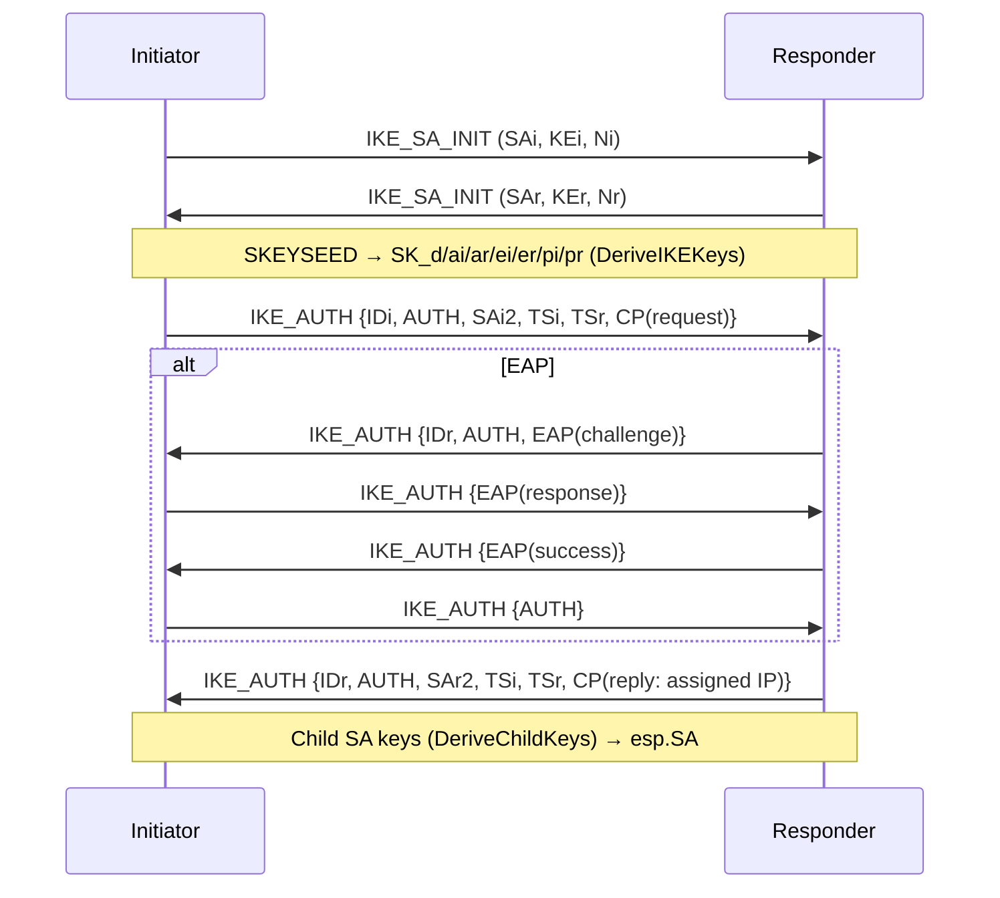
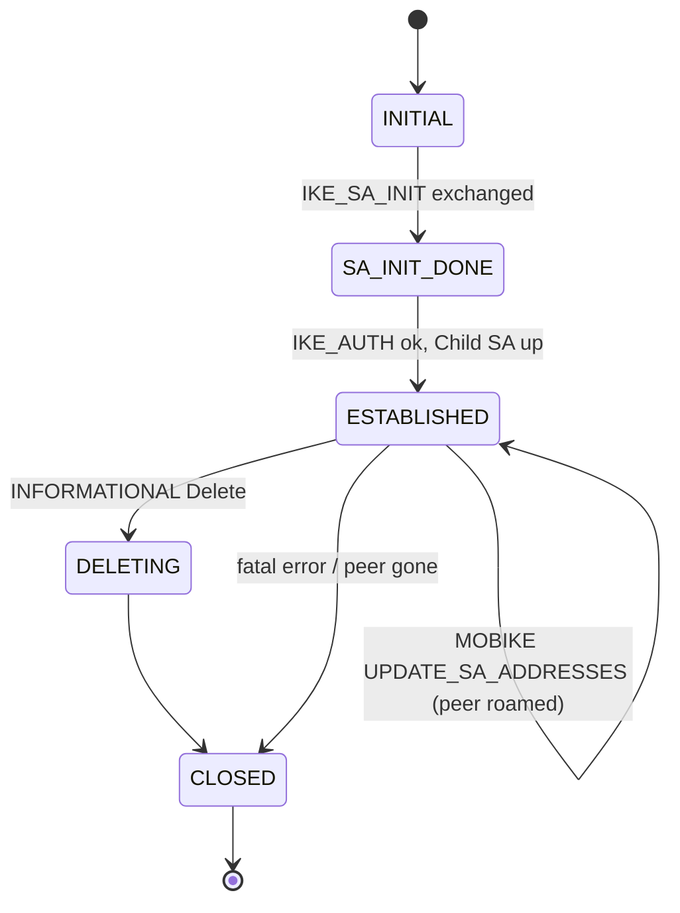

# internal/ikev2/ike

The IKEv2 control plane: the `IKE_SA_INIT` + `IKE_AUTH` handshake (PSK and
EAP-MSCHAPv2), the key schedule, Child-SA negotiation, and the `Client`/`Server`
session drivers. It sits on [`payload`](../payload) (wire format),
[`transform`](../transform) (algorithm lookup), [`eap`](../eap) (username/password
auth), and produces [`esp`](../esp) SAs for the data path.

## Specifications

- [RFC 7296](https://www.rfc-editor.org/rfc/rfc7296) — IKEv2 (exchanges, key derivation §2.14/§2.17, AUTH §2.15).
- [RFC 3947](https://www.rfc-editor.org/rfc/rfc3947) / [RFC 3948](https://www.rfc-editor.org/rfc/rfc3948) — NAT-T detection and UDP-encapsulated ESP.
- [RFC 7296 §3.15](https://www.rfc-editor.org/rfc/rfc7296#section-3.15) — Configuration payload (address assignment).
- [RFC 4555](https://www.rfc-editor.org/rfc/rfc4555) — MOBIKE (address agility for a roaming peer).

## Handshake and SA lifecycle

Two round trips bring an SA up: `IKE_SA_INIT` negotiates crypto and does the DH
exchange; `IKE_AUTH` (encrypted under the freshly derived keys) proves identity
and negotiates the first Child SA. EAP inserts extra `IKE_AUTH` round trips.

The `SAState` lifecycle:

## API surface

- **Session drivers** — `Client`/`NewClient(ClientConfig)` → `ClientResult`;
  `Server`/`NewServer(Config)`. Both speak both auth methods.
- **Key schedule** — `DeriveIKEKeys(...) (skeyseed, SAKeys)`,
  `DeriveChildKeys(...)`, `AuthOctets(...)`, `PSKAuth(...)`. `SAKeys` holds
  `SK_d/ai/ar/ei/er/pi/pr`.
- **Suite selection** — `SelectIKESuite`, `SelectESPSuite`,
  `DefaultIKEProposal`, `DefaultESPProposal`, `Suite`, `ESPSuite`.
- **Child SA / data path** — `ChildSA`, `BuildESPSA(*ChildSA) (*esp.SA, error)`;
  `DataPath` interface with `PumpDataPath`/`NewPumpDataPath` wiring the SA to
  [`dataplane`](../../../dataplane).
- **Identity** — `FQDNIdentity`, `IPIdentity`.
- **Errors/state** — `ErrAuthFailed`, `SAState`.

## Implementation notes & caveats

- **`IKE_AUTH` is encrypted, `IKE_SA_INIT` is not.** The AUTH payload signs the
  first message plus the peer's nonce plus `SK_p` (`AuthOctets`); getting the
  signed-octets construction byte-exact is what interoperates with strongSwan.
- **PSK vs EAP diverge only after SA_INIT.** EAP adds round trips carried by
  [`eap`](../eap); the initiator's final AUTH in the EAP flow is keyed from the
  EAP MSK, not the PSK.
- **NAT-T floats to UDP/4500 and forces UDP-encap of ESP.** The non-ESP marker
  disambiguates IKE from ESP on the shared 4500 socket; the [`esp`](../esp) path
  assumes this encapsulation.
- **`BuildESPSA` builds the data-path `ESPCrypter` once per SA** — never per
  packet. Reuse the returned `*esp.SA`; rebuilding it would reintroduce the
  per-packet allocations the data-plane benchmarks were tuned to remove.
- **MOBIKE (RFC 4555) is negotiated with `MOBIKE_SUPPORTED` in `IKE_AUTH`.** A
  roaming peer then sends a protected `UPDATE_SA_ADDRESSES` INFORMATIONAL from
  its new address; the responder relocates the SA to the packet's *observed*
  source (never a claimed one — a NAT may have rewritten it), re-runs NAT
  detection, and repoints every Child SA's ESP return address (`PumpDataPath`
  gets an immediate `UpdatePeerAddr`, ahead of the first inbound ESP from the
  new address). `COOKIE2` return-routability probes are echoed verbatim
  (§3.7). The initiator drives its own move with `Client.Roam`, which rebinds
  the NAT-T socket and runs the exchange; `Client.MobikeEnabled` reports
  whether the server agreed. This mirrors kernel/strongSwan behaviour, so a
  native macOS/Windows IKEv2 client keeps its tunnel across a network change
  rather than re-handshaking.
