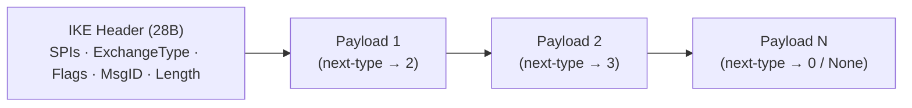

# internal/ikev2/payload

IKEv2 wire-format encoding and decoding: the fixed IKE header and the chain of
generic payloads, per [RFC 7296](https://www.rfc-editor.org/rfc/rfc7296). This is
the codec every other IKEv2 package builds on; it also owns the IANA transform-ID
registry constants ([`transform`](../transform) maps them onto primitives).

## Specifications

- [RFC 7296](https://www.rfc-editor.org/rfc/rfc7296) — IKEv2, header + payload formats.
- [RFC 7427](https://www.rfc-editor.org/rfc/rfc7427) — Signature Authentication (AUTH payload method).
- [RFC 5996 §3.15](https://www.rfc-editor.org/rfc/rfc5996#section-3.15) — Configuration payload (CP), inherited by 7296.
- IANA [IKEv2 Parameters](https://www.iana.org/assignments/ikev2-parameters/) — transform IDs (`ENCR_*`, `PRF_*`, `AUTH_*`, `DH_*`, `ESN_*`).

## Message shape

An IKEv2 message is a 28-byte header (`HeaderLen`) followed by a singly-linked
chain of payloads, each announcing the *next* payload's type in its generic
header:

Nested structure worth knowing: an **SA** payload contains **Proposals**, each
containing **Transforms**, each of which may carry **Attributes** (the key length
lives in `AttrKeyLength`).

## API surface

- **Header** — `Header`, `ParseHeader`, `HeaderLen`; `ExchangeType`
  (`IKE_SA_INIT`, `IKE_AUTH`, `CREATE_CHILD_SA`, `INFORMATIONAL`), `FlagInitiator`
  and friends.
- **Builder** — `NewBuilder()` assembles a payload chain and fixes up the
  next-payload links and length fields.
- **Per-payload marshal/parse** — `MarshalSA`/`…`, `MarshalKE`, `MarshalNonce`,
  `MarshalAuth`/`ParseAuth`, `MarshalID`/`ParseID`, `MarshalNotify`/`ParseNotify`,
  `MarshalDelete`/`ParseDelete`, `MarshalCP`/`ParseCP`, `MarshalTS`.
- **Config payload** — `CPPayload`, `CFGAttr`, `CFGAttrType`
  (`CFGInternalIP4Address`, DNS, …), `CFGType` (request/reply).
- **Registry constants** — `ENCR_AES_CBC`/`ENCR_AES_GCM_16`/…, `PRF_HMAC_SHA1`/…,
  `AUTH_HMAC_SHA1_96`/…, `DH_MODP_2048`/…, `ESN_NONE`/…, `AttrKeyLength`.
- **Errors** — `ErrTruncated` for a short buffer.

## Implementation notes & caveats

- **Parsers read attacker-controlled bytes pre-authentication.** IKE_SA_INIT is
  unauthenticated, so every `Parse*` here is a fuzz target
  (`FuzzParse*`); a panic would be a remote crash. Bounds are checked and
  `ErrTruncated` returned rather than slicing blindly.
- **The Builder owns the next-payload chaining and length back-patching** — build
  through it rather than concatenating `Marshal*` outputs by hand, or the
  next-payload type of the final assembled chain will be wrong.
- This package is pure wire format: **no crypto, no state machine.** It knows the
  transform-ID *numbers* but nothing about the algorithms behind them — that seam
  is deliberate and lives in [`transform`](../transform).
