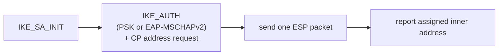

# internal/ikev2/probe

A minimal IKEv2 initiator used to **smoke-test a running server**. It performs
`IKE_SA_INIT` + `IKE_AUTH` (PSK or EAP-MSCHAPv2), requests a config address, sends
one ESP packet, and reports the assigned address.

It hand-rolls the exchange directly against the [`payload`](../payload) codec
rather than going through the production client, so it exercises the wire format
itself. It is a **diagnostic tool, not a full client**: no TUN device, no
privileges.

## Specifications

Same wire protocol as the real client — [RFC 7296](https://www.rfc-editor.org/rfc/rfc7296)
(IKEv2) and [RFC 4303](https://www.rfc-editor.org/rfc/rfc4303) (the single ESP
packet it sends).

## Flow

## API surface

- `Run(args []string) error` — parse args, run the exchange, print the result.

## Implementation notes & caveats

- **Deliberately parallel to the production path, not shared with it.** Because it
  builds messages by hand against the codec, it catches wire-format regressions
  the real client might paper over with matching bugs on both encode and decode.
- No TUN, no routing, no privileges — it validates that a server *negotiates and
  assigns*, not that packets traverse an interface. For a full data-path check use
  the interop tests or the real `veepin connect ikev2`.
