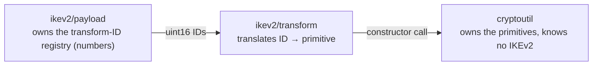

# internal/ikev2/transform

The seam between IKEv2's wire protocol and the algorithm implementations. It maps
IANA transform IDs onto concrete [`cryptoutil`](../../cryptoutil) primitives.

Three packages, three responsibilities:

Keeping the lookup here is what lets `cryptoutil` stay reusable by other VPN
protocols, whose registries number the same algorithms differently.

## API surface

- `Cipher(encrID, keyBits) (SKCipher, error)` — handshake cipher for an `ENCR_*` ID.
- `ESPCrypter(encrID, keyBits, encKey, integID, integKey) (ESPCrypter, error)` —
  the data-path cipher for a Child SA (AES-GCM ignores the integ args; AES-CBC
  pairs them into an encrypt-then-MAC crypter).
- `PRF(id) (*PRF, error)` — a `PRF_*` ID → keyed PRF.
- `Integrity(id) (*Integrity, error)` — an `AUTH_*` ID → truncated-HMAC ICV.
- `DH(id) (DHGroup, error)` — a `DH_*` ID → Diffie-Hellman group.

Each returns an error for an ID this build does not implement, which is how a
proposal offering something unsupported is rejected rather than mis-keyed.

## Implementation notes & caveats

- **Adding an algorithm is a two-file change**: a `case` here **and** a
  constructor in `cryptoutil`. If you add one without the other, this package
  won't compile against the missing constructor — by design.
- This is the *only* place IKEv2 transform-ID knowledge meets the primitives. Do
  not teach `cryptoutil` any IANA numbers, and do not construct ciphers directly
  from a protocol package — go through here so the supported-algorithm set stays
  in one auditable spot.
