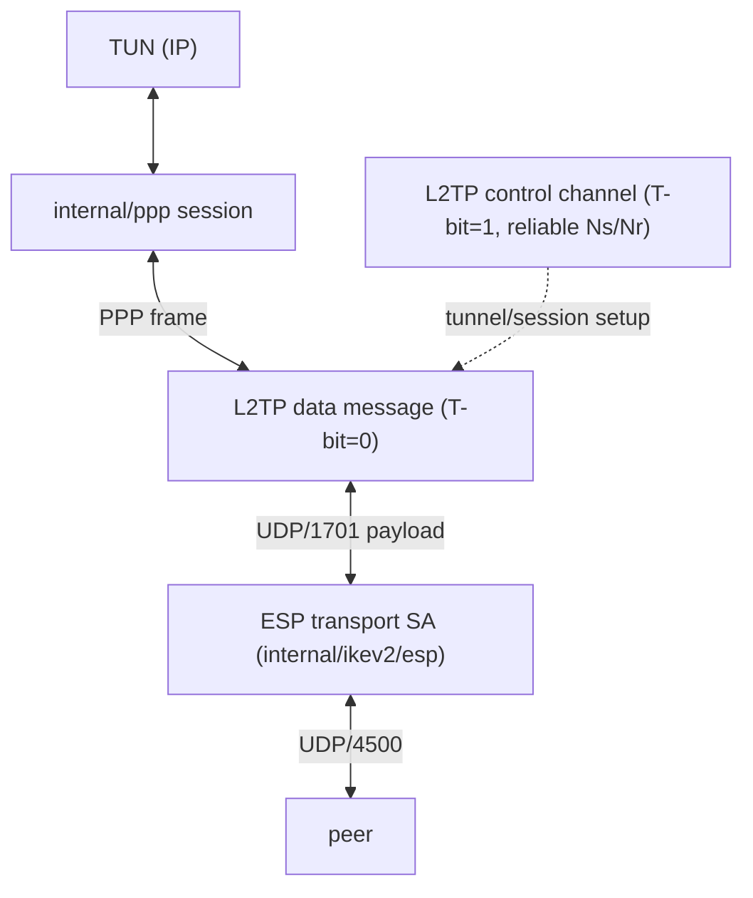
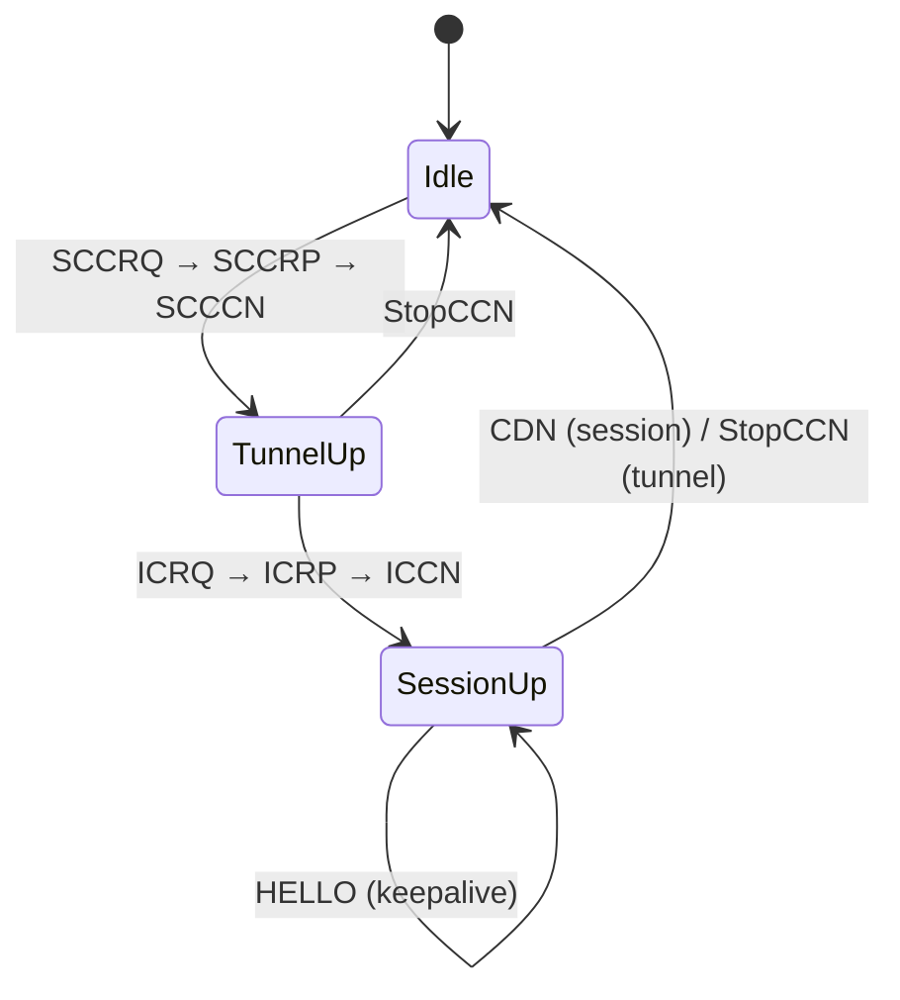

# internal/l2tp

The L2TP control and data channels that carry a PPP session over IPsec
transport-mode ESP — the "L2TP/IPsec" a stock xl2tpd/strongSwan stack and every
native-OS client speak. Both roles: the LAC (client, initiator) opens the tunnel
and places the call; the LNS (server, responder) accepts them.

## Specification

- [RFC 2661](https://www.rfc-editor.org/rfc/rfc2661) — L2TP (header §3.1, AVP format §4.1, control state machine §7).

The engine is **transport-neutral**: it writes finished L2TP datagrams through a
send closure and is fed inbound datagrams by its owner, so the same `Tunnel` runs
over a bare UDP socket (tests) or inside an ESP transport SA (production).

## Layering

## Control channel state machine

Reliable (Ns/Nr sequenced, acked, retransmitted). Tunnel then session:

Control vs data is demuxed by the header **T-bit**.

## API surface

- **Client (LAC)** — `NewClient(conn, tun, ClientConfig) *Client`; `RoleLAC`.
- **Server (LNS)** — `NewServer(rawIKE, rawNATT, tun, ServerConfig) *Server`.
- **Tunnel engine** — `NewTunnel(role, send, handler) *Tunnel`; `Role`, `Handler`,
  `NetConfig` (assigned addressing).

## Implementation notes & caveats

- **AVP hiding is not implemented — deliberately.** veepin never sets a tunnel
  secret, so no outbound AVP is obfuscated; a *hidden inbound* AVP is **rejected**
  rather than silently mis-parsed. Don't treat that rejection as a bug.
- **The control channel must be reliable before anything works** — Ns/Nr
  sequencing, acking, and retransmission turn UDP into an ordered channel, exactly
  as [`openvpn/reliable`](../openvpn/reliable) does for OpenVPN (different wire, same
  problem).
- **Transport-neutral is the key property.** The `Tunnel` doesn't own a socket or
  the ESP SA; wiring it to a bare UDP socket (tests) vs an ESP transport SA
  (production) is the owner's job. This is what makes the state machine unit-testable
  without IPsec.
- Data messages carry PPP frames handed to [`internal/ppp`](../ppp); the inner IP
  ultimately rides TUN ⇄ PPP ⇄ L2TP ⇄ ESP.
