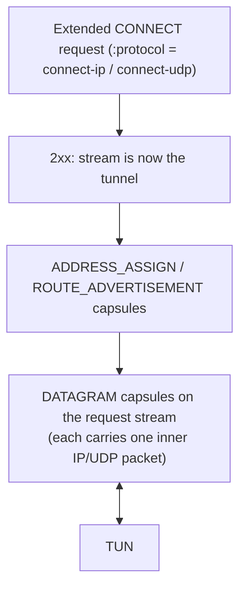

# internal/masque

MASQUE CONNECT-IP and CONNECT-UDP: IP- and UDP-over-HTTP/3. The HTTP/3 substrate is
the [`http3`](./http3) subpackage; this package is the CONNECT protocol on top of
it — the capsules that assign an address and advertise routes, the HTTP-Datagram
payload that carries an inner packet, and the client/server roles that turn a
request stream into a tunnel.

## Specifications

- [RFC 9484](https://www.rfc-editor.org/rfc/rfc9484) — CONNECT-IP (IP proxying over HTTP).
- [RFC 9298](https://www.rfc-editor.org/rfc/rfc9298) — CONNECT-UDP (UDP proxying over HTTP).
- [RFC 9297](https://www.rfc-editor.org/rfc/rfc9297) — HTTP Datagrams and the Capsule Protocol.
- [RFC 9220](https://www.rfc-editor.org/rfc/rfc9220) — Extended CONNECT for HTTP/3.

## Capsule-mode tunnel

## Why capsule mode (and not QUIC datagrams)

`x/net/quic` (v0.56.0) has **no** RFC 9221 QUIC DATAGRAM frames — `dgram.go` in its
internals is an unrelated UDP type, a false signal. So every inner packet rides as
a **DATAGRAM capsule on the request stream** rather than an unreliable QUIC
datagram. This is a documented **performance** boundary, not a correctness one: the
capsule formats are identical either way. What capsule mode costs is reliability and
ordering the tunnelled traffic never asked for.

## API surface

- **Headers/paths** — `ConnectIPHeaders`/`ConnectIPPath`,
  `ConnectUDPHeaders`/`ConnectUDPPath`, `IsConnectIP`/`IsConnectUDP`,
  `ParseConnectUDPTarget`.
- **Capsules** — `WriteCapsule`, `Capsule`, `CapsuleDatagram`/…;
  `EncodeAddresses`/`ParseAddresses` (`AddressEntry`),
  `EncodeRoutes` (`RouteEntry`).
- **Datagram payload** — `EncodeDatagramPayload`/`DecodeDatagramPayload`.
- **Allocation-free data path** — `DatagramEncoder` (Encode reuses its buffer) and
  `CapsuleReader` (Read reuses its buffer; **borrowed-buffer** contract).
- `ErrCapsuleTooLarge`.

## Implementation notes & caveats

- **The data path is allocation-free and guarded.** `DatagramEncoder`/`CapsuleReader`
  hand out **borrowed** buffers reused on the next call — the caller must consume or
  copy before calling again. An `AllocsPerRun` test pins zero allocs per packet;
  send went 465→23 ns and receive 228→43 ns with this. See
  [[masque-datapath-allocation-free]].
- **Capsule mode is the current reality, not a choice** — revisit only when
  `x/net/quic` gains RFC 9221 datagram frames. The earlier framing of capsule mode
  as "the perf lever" was misleading; the real win was the allocation work above.
- Capsule and HTTP-Datagram parsers read proxied bytes and are fuzzed
  (`FuzzParseCP`, …).
