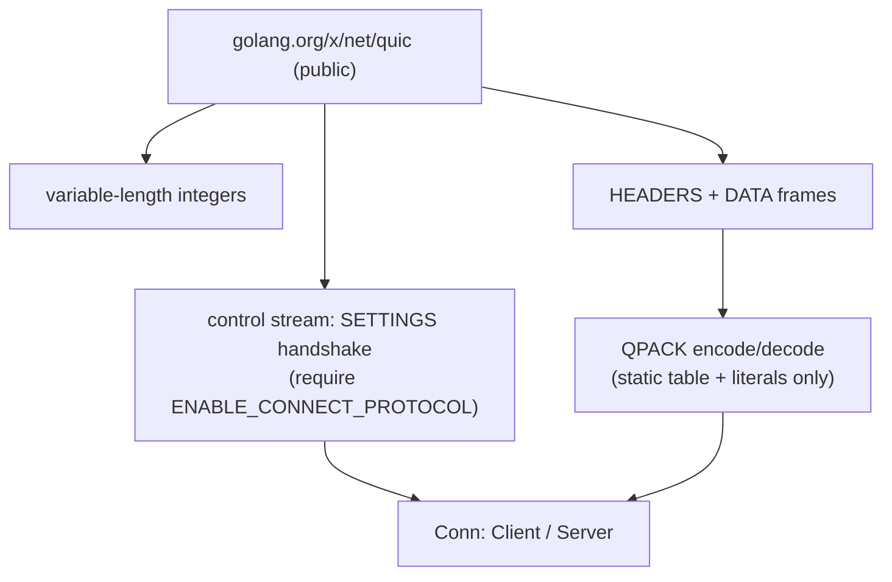

# internal/masque/http3

The sliver of HTTP/3 that MASQUE needs, built on the public
`golang.org/x/net/quic` package. **Not** a general HTTP/3 stack — just enough to
make one Extended CONNECT request work and interoperate with a real HTTP/3 proxy.

## Why this exists

`x/net` ships an HTTP/3 stack, but only for `net/http`'s private use — its public
package exports nothing, and its internals have **no** Extended CONNECT, **no** HTTP
Datagrams, and **no** Capsule Protocol, which are the three things a MASQUE tunnel
is made of. So this package implements the minimum below the CONNECT layer.

## Specifications

- [RFC 9114](https://www.rfc-editor.org/rfc/rfc9114) — HTTP/3 (frames, control stream, SETTINGS).
- [RFC 9204](https://www.rfc-editor.org/rfc/rfc9204) — QPACK (here: zero-capacity dynamic table only).
- [RFC 9220](https://www.rfc-editor.org/rfc/rfc9220) — Extended CONNECT (`ENABLE_CONNECT_PROTOCOL`).

## What it implements

## API surface

- `Client(ctx, *quic.Conn) (*Conn, error)` / `Server(ctx, *quic.Conn)`.
- **Varints** — `AppendVarint`, `ConsumeVarint`, `ReadVarint`, `VarintLen`.
- **Frames** — `ReadFrame`, `WriteFrame`; `FrameData`/`FrameHeaders`.
- **Fields/QPACK** — `Field`, `EncodeFieldSection`/`DecodeFieldSection`.
- Constants (`StreamControl`, `SettingQPACKMaxTableCapacity`, …); errors
  `ErrFrameTooLarge`, `ErrNoConnectProtocol`, `ErrQPACK`, `ErrVarintOverflow`.

## Implementation notes & caveats

- **QPACK is restricted to a zero-capacity dynamic table** — encoder emits only
  static-table refs and literals; decoder **rejects** any dynamic-table reference
  (`ErrQPACK`). That is legal HTTP/3 and dodges the QPACK blocked-stream complexity
  entirely. A proxy that insists on the dynamic table is unsupported by design.
- **`ENABLE_CONNECT_PROTOCOL` is mandatory** — without it in the peer's SETTINGS,
  Extended CONNECT can't be issued and `ErrNoConnectProtocol` is returned rather
  than sending a request the proxy will reject.
- **Frame/varint readers use a single reused scratch buffer** (`ReadVarint` one
  8-byte buffer; frame writes go through `hdrBuf`) to keep the CONNECT setup path
  from allocating per read — part of the same allocation discipline as the
  [`masque`](..) data path.
- Sized for **one CONNECT request**, not web serving: no request multiplexing
  semantics beyond what a tunnel needs.
