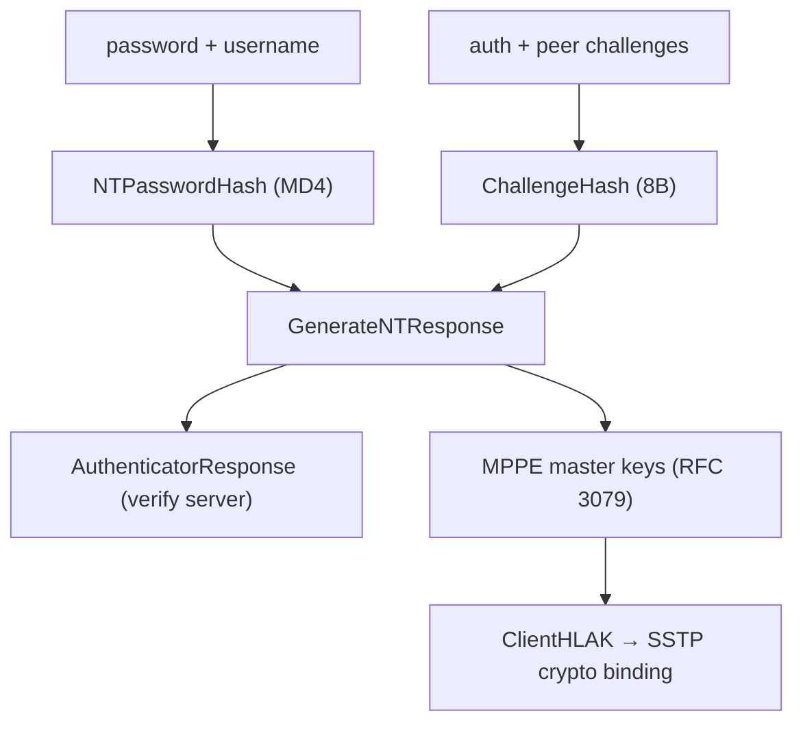

# internal/mschap

MS-CHAPv2 authentication primitives and the MPPE key derivation a PPP client
needs, plus the higher-layer authentication key (HLAK) that SSTP's crypto binding
is built from. Transport-agnostic: it computes challenge responses, verifies the
server's authenticator, and derives keys, but knows nothing of PPP or SSTP framing.

## Specifications

- [RFC 2759](https://www.rfc-editor.org/rfc/rfc2759) — MS-CHAPv2 (NT hash, challenge hash, NT response, authenticator response).
- [RFC 3079 §3](https://www.rfc-editor.org/rfc/rfc3079#section-3) — MPPE key derivation (`GetMasterKey`, `GetAsymmetricStartKey`).

## What it computes

## API surface

- `NTPasswordHash(password)`, `ChallengeHash(peer, auth, username)`.
- `GenerateNTResponse(auth, peer, username, password)` — the client's response.
- `AuthenticatorResponse(...)` — verify the server's authenticator string.
- `ClientHLAK(password, ntResponse)` — the 32-byte HLAK (`HLAKLen`) SSTP binds.
- `ChallengeLen = 16`, `NTResponseLen`.

## Implementation notes & caveats

- **Two MS-CHAPv2 paths exist in the tree, on purpose.** This package derives the
  **MPPE** send/receive keys (what SSTP binds to TLS); the IKEv2
  [`eap`](../ikev2/eap) server has its own MS-CHAPv2 geared to the **IKEv2 MSK**.
  They are not duplicates — different outputs from the same challenge/response.
- **Every construction is pinned to the RFCs' own test vectors.** These are
  little-used, byte-fiddly derivations that are easy to get subtly wrong; the
  vectors are the guardrail — do not "clean up" a step without re-checking them.
- Relies on MD4 for the NT hash (mandated by the protocol); it is a legacy
  construction used only where the spec requires it, protected by the outer TLS
  channel in SSTP.
