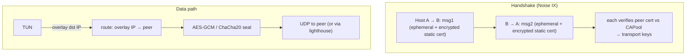

# internal/nebula

A from-scratch implementation of the Nebula overlay mesh protocol (Slack's
Nebula): certificate-authenticated peers, a Noise `IX` handshake, and an
AES-GCM/ChaCha20 data path over UDP, routed by overlay (VPN) IP address. veepin
interoperates with the stock `nebula` binary as both a host and (via a lighthouse)
a peer.

## Specification

Nebula has no RFC; the wire protocol is defined by its Go implementation.

- Handshake: [Noise Protocol Framework](https://noiseprotocol.org/noise.html), pattern **`IX`** (see caveats).
- Certificates: Nebula's own **protobuf v1** certificate format, Ed25519/ECDSA-signed.
- Primitives: Curve25519 / P-256 ECDH, AES-256-GCM or ChaCha20-Poly1305.

## Handshake and routing

## API surface

- `NewHost(cfg, conn, tun) (*Host, error)` — the node; `Config`, `Logger`.
- **Certificates** — `UnmarshalCertificate(PEM)`, `CAPool`/`NewCAPoolFromPEM`,
  `Certificate`, `Identity`/`NewIdentity`; `Curve` (`Curve25519`/P-256).
- Key loaders — `UnmarshalEd25519PrivateKeyPEM`, `UnmarshalX25519PrivateKeyPEM`.
- `Overhead`, `X25519KeySize`; errors `ErrExpired`, `ErrPeerRejected`, `ErrNoRoute`.

## Implementation notes & caveats

- **The Noise pattern is plain `IX`, not `IXpsk0`** — despite what several names in
  Nebula's own source suggest. The **protocol name string seeds the handshake
  hash**, so getting this wrong makes every handshake fail with a peer. This was a
  real trap; see the [[nebula-noise-is-plain-ix]] project note.
- **Certificates are protobuf *v1* and must be byte-exact.** Signatures are verified
  by *re-marshalling* the certificate and checking the signature over those bytes,
  so the encoder has to reproduce Nebula's v1 protobuf output exactly — a
  non-canonical re-encoding fails verification even for a valid cert. Use the v1
  encoder; see [[nebula-certs-are-v1-protobuf]].
- **Routing is by overlay IP**, not by socket peer: the TUN destination address
  selects the peer (`ErrNoRoute` if none), and a lighthouse resolves overlay IP →
  underlay UDP address for peers not directly known.
- **The anti-replay window here was the duplicate** that seeded
  [`internal/replay`](../replay) (shared with `internal/toy`); this package can use
  that shared window since its rule is exactly "a counter and a window".
- **The data path is allocation-guarded.** `encrypt` allocates once (the returned
  packet — the nonce is built in its spare tail, not a fresh escaping slice) and
  `decrypt` not at all (in place, with a per-tunnel receive-nonce scratch that is
  safe because decrypt runs only on the Host's single `readUDP` goroutine).
  `TestDataPathAllocations` pins both; the root `README.md` has the numbers.
