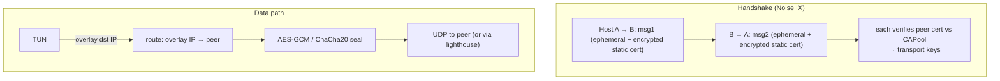

# internal/nebula

A from-scratch implementation of the Nebula overlay mesh protocol (Slack's
Nebula): certificate-authenticated peers, a Noise `IX` handshake, and an
AES-GCM/ChaCha20 data path over UDP, routed by overlay (VPN) IP address. veepin
interoperates with the stock `nebula` binary as both a host and (via a lighthouse)
a peer.

## Specification

Nebula has no RFC; the wire protocol is defined by its Go implementation.

- Handshake: [Noise Protocol Framework](https://noiseprotocol.org/noise.html), pattern **`IX`** (see caveats).
- Certificates: Nebula's own **protobuf v1** certificate format, Ed25519/ECDSA-signed.
- Primitives: Curve25519 / P-256 ECDH, AES-256-GCM or ChaCha20-Poly1305.

## Handshake and routing

```mermaid
flowchart TD
    subgraph "Handshake (Noise IX)"
      H1["Host A → B: msg1 (ephemeral + encrypted static cert)"]
      H1 --> H2["B → A: msg2 (ephemeral + encrypted static cert)"]
      H2 --> V["each verifies peer cert vs CAPool<br/>→ transport keys"]
    end
    subgraph Data path
      TUN["TUN"] -->|overlay dst IP| RT["route: overlay IP → peer"]
      RT --> ENC["AES-GCM / ChaCha20 seal"]
      ENC --> UDP["UDP to peer (or via lighthouse)"]
    end
```

## API surface

- `NewHost(cfg, conn, tun) (*Host, error)` — the node; `Config`, `Logger`.
- **Certificates** — `UnmarshalCertificate(PEM)`, `CAPool`/`NewCAPoolFromPEM`,
  `Certificate`, `Identity`/`NewIdentity`; `Curve` (`Curve25519`/P-256).
- Key loaders — `UnmarshalEd25519PrivateKeyPEM`, `UnmarshalX25519PrivateKeyPEM`.
- `Overhead`, `X25519KeySize`; errors `ErrExpired`, `ErrPeerRejected`, `ErrNoRoute`.

## Implementation notes & caveats

- **The Noise pattern is plain `IX`, not `IXpsk0`** — despite what several names in
  Nebula's own source suggest. The **protocol name string seeds the handshake
  hash**, so getting this wrong makes every handshake fail with a peer. This was a
  real trap; see the [[nebula-noise-is-plain-ix]] project note.
- **Certificates are protobuf *v1* and must be byte-exact.** Signatures are verified
  by *re-marshalling* the certificate and checking the signature over those bytes,
  so the encoder has to reproduce Nebula's v1 protobuf output exactly — a
  non-canonical re-encoding fails verification even for a valid cert. Use the v1
  encoder; see [[nebula-certs-are-v1-protobuf]].
- **Routing is by overlay IP**, not by socket peer: the TUN destination address
  selects the peer (`ErrNoRoute` if none), and a lighthouse resolves overlay IP →
  underlay UDP address for peers not directly known.
- **The anti-replay window here was the duplicate** that seeded
  [`internal/replay`](../replay) (shared with `internal/toy`); this package can use
  that shared window since its rule is exactly "a counter and a window".
- **The data path is allocation-guarded.** `encrypt` allocates once (the returned
  packet — the nonce is built in its spare tail, not a fresh escaping slice) and
  `decrypt` not at all (in place, with a per-tunnel receive-nonce scratch that is
  safe because decrypt runs only on the Host's single `readUDP` goroutine).
  `TestDataPathAllocations` pins both; the root `README.md` has the numbers.
- **Relays forward without decrypting, and the hop to them is authenticated but
  not encrypted.** The relay has to read the inner header to know where to send,
  and holds none of the end-to-end keys, so a relay learns **who is talking to
  whom and how much** while learning nothing about the traffic. That is nebula's
  design rather than a choice made here (`SendVia` calls `EncryptDanger` with a
  nil plaintext), and it is the reason `-relay-for` is off by default: agreeing
  to relay is a decision about what this host's operator is willing to see.
- **A relay is a fallback, never a preference.** The direct path is attempted on
  every send and every handshake, and a relay is used only when it fails. Both
  run in parallel rather than the relay waiting on a timeout, so a merely slow
  direct path still wins.
- **The handshake is relayed too, not just the traffic.** It has to be: the
  payload a relay forwards is encrypted under keys the two ends agree with each
  other, so if the exchange that agrees them cannot cross, nothing can. Relaying
  only data deadlocks — the relay is never used because the tunnel it would
  carry never comes up.
- **A relay's address is never recorded as a peer's own.** A handshake that
  crossed a relay arrives from the relay's socket, and treating that as the
  peer's direct address makes every later packet a plain datagram to the relay,
  which the socket accepts and the relay drops. The tunnel reports itself up,
  the sends succeed, and nothing arrives — see `isRelayUnderlay`.
- **A quiet tunnel is asked whether it still works, and dropped if it does not
  answer.** This end always replied to nebula's `test` packets and never sent
  one, so the mechanism proved this host alive to peers and learned nothing
  about them; the only thing that noticed a tunnel had silently stopped carrying
  traffic was `expireTunnels`, at ten minutes. `probeQuietTunnels` sends a test
  request to any tunnel quiet for `tunnelProbeIdle` and drops it if nothing
  answers within `tunnelProbeGrace`.

  It drops **the tunnel, not the host**, and that is the difference between a
  mesh and every point-to-point protocol in this tree: one unreachable peer is
  not a dead session, so nebula deliberately does not implement
  `client.Prober` — whose contract is that a failed probe closes the session.
  A dropped tunnel costs nothing, because the next packet for that peer starts
  a fresh handshake.
- **Not implemented: multi-lighthouse consensus.** Two lighthouses that disagree
  about where a host is are not reconciled; the last answer wins.
