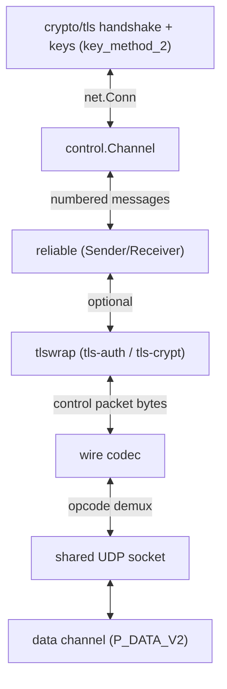

# internal/openvpn/control

OpenVPN's TLS control channel: it turns the lossy UDP datagram path into the
ordered, reliable byte stream that `crypto/tls` runs its handshake over. A
`Channel` implements `net.Conn`, so the standard library's TLS stack drives it
unmodified.

## Where it sits in the OpenVPN stack

Underneath the `net.Conn`, each write is chunked into `P_CONTROL_V1` messages
numbered by the [`reliable`](../reliable) layer; each read reassembles the in-order
payloads that layer delivers. **Reliable message 0 is the hard-reset** that opens
the session and carries no TLS bytes; messages 1+ carry the handshake and then the
key-negotiation exchange.

## API surface

- `New(send, keyID, timeout, wrap) (*Channel, error)` — client role.
- `NewServer(send, keyID, timeout, wrap) (*Channel, error)` — server role.
- `Channel` — implements `net.Conn`; `Deliver` feeds it inbound control packets.
- `Wrapper` — the optional [`tlswrap`](../tlswrap) protection, or nil for plain.

## Implementation notes & caveats

- **The Channel does not own the UDP socket** — the data channel shares it. The
  caller runs *one* read loop that demuxes datagrams by opcode, hands control
  packets to `Deliver`, and supplies the `send` function the Channel writes
  through. One reader across both channels is the invariant; don't add a second.
- **`crypto/tls` sees an ordinary `net.Conn`**, which is the whole point: the
  reliability and framing complexity lives below the `net.Conn` boundary so the
  handshake code is stock.
- The `Wrapper` is applied by the layer below in the diagram; the Channel just
  passes it down, so tls-auth/tls-crypt compose without the TLS code knowing.
