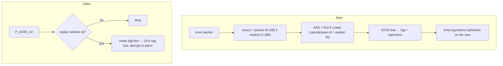

# internal/openvpn/data

The OpenVPN data channel: AES-256-GCM sealing and opening of `P_DATA_V2` packets
(and an AES-CBC+HMAC path for older peers), with a replay window over the packet
counter. Keyed by [`keys`](../keys); an allocation-guarded hot path.

## Specification

Wire layout from OpenVPN's `crypto.c` (`openvpn_encrypt_aead`);
AES-GCM per the AEAD construction, replay per OpenVPN's own window.

## P_DATA_V2 AEAD packet layout

```
byte 0        opcode<<3 | key_id        (P_DATA_V2)
bytes 1..3    peer-id (24-bit, big-endian)
bytes 4..7    packet ID (32-bit, big-endian)
bytes 8..23   GCM auth tag (16 bytes)     ← tag BEFORE ciphertext (unlike Go)
bytes 24..    ciphertext
```



The AAD is the header + packet ID, so a tampered header fails the tag.

## API surface

- `Cipher` / `New(dk keys.DataKeys, peerID, keyID)` — the AES-GCM path.
- `CBCCipher` / `NewCBC(...)` — AES-CBC + HMAC for legacy peers.
- `IsDataOpcode`, `IsPing`, `Ping` (the keepalive sentinel), `PDataV1`/`PDataV2`.

## Implementation notes & caveats

- **Tag-first wire order is the interop trap.** OpenVPN places the GCM tag *before*
  the ciphertext; Go's AEAD wants it after. Seal writes it in OpenVPN order; Open
  rotates it into Go's order **in place** — no reallocation.
- **Allocation profile (guarded by `TestDataPathAllocations`):** Seal is one
  allocation (the returned packet), Open is zero. ~1.9 GB/s seal / ~2.9 GB/s open
  at 1400 B. The nonce is built in the output buffer's tail on Seal (a stack nonce
  through `cipher.AEAD` would escape to the heap); Open reuses a per-`Cipher`
  receive-nonce buffer — **safe only because Open runs on the single inbound pump
  goroutine.**
- **The replay window is OpenVPN's own**, distinct from the [`data`](.) CBC
  variant and from the shared [`internal/replay`](../../replay) — the two OpenVPN
  variants differ from each other, and both are pinned by interop.
