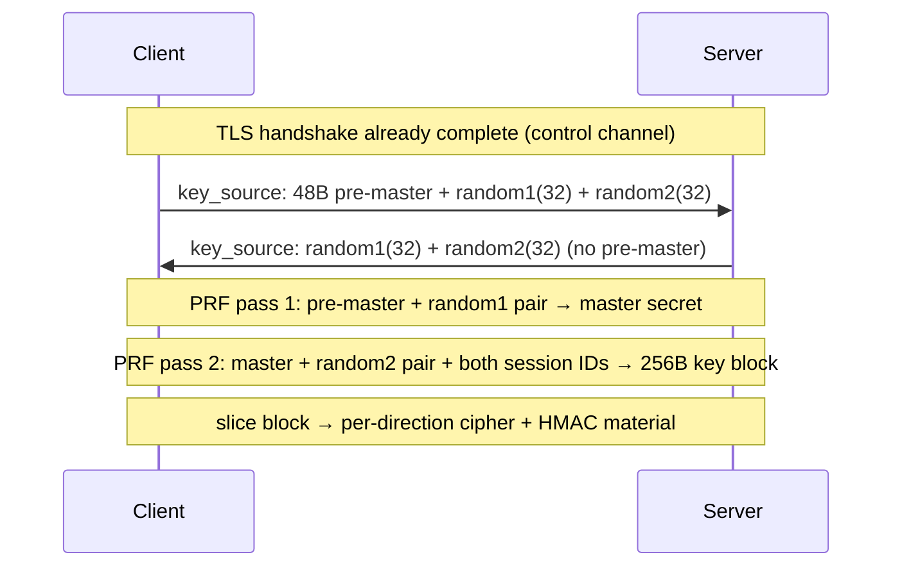

# internal/openvpn/keys

OpenVPN's "key method 2" key exchange and the derivation that turns it into
data-channel keys. Runs over the [`control`](../control) channel after the TLS
handshake completes.

## Specification

Wire layouts and PRF construction follow OpenVPN's `ssl.c`
(`key_method_2_write/read`, `generate_key_expansion`, `openvpn_PRF`). The PRF is
the **TLS 1.0 PRF** (MD5 and SHA1 `P_hash` XORed together),
[RFC 2246 §5](https://www.rfc-editor.org/rfc/rfc2246#section-5). Multi-byte lengths
are big-endian.

## Key exchange and derivation

For AES-256-GCM the cipher slot yields the 32-byte key and the HMAC slot the
8-byte **implicit IV** the [`data`](../data) nonce needs.

## API surface

- `KeySource` / `NewClientKeySource()` / `NewServerKeySource()` — generate the
  local key_source; `ParseServer`/`ParseClient` decode the peer's.
- `KeySource2`, `DataKeys` (GCM), `CBCKeys` (AES-CBC + HMAC); `GCMKeyLen`.
- `SessionID`; `ErrShortMessage`.

## Implementation notes & caveats

- **Asymmetric exchange: only the client sends the pre-master.** The server
  contributes randoms only; both then run the identical two-pass derivation. A
  client that also sent a pre-master, or a server that expected one, breaks interop.
- **Both session IDs feed pass 2** — the key block is bound to the specific session
  pair, so replaying an old key_source into a new session yields different keys.
- **The GCM implicit IV comes from the HMAC key slot**, not a separate field; that
  slot is repurposed because GCM needs no HMAC. Slicing the 256-byte block into the
  right offsets per direction and cipher is the fiddly part — it is pinned by the
  `openvpn` interop cell.
