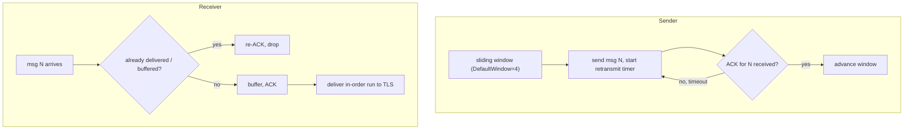

# internal/openvpn/reliable

OpenVPN's control-channel reliability algorithm: a sliding-window retransmitting
sender and a reordering, acknowledging receiver that together turn UDP into the
ordered, lossless byte stream the TLS handshake needs. Decoupled from the wire
format and session IDs — it works in terms of message payloads and 32-bit packet
IDs, so retransmit/reorder/dedup/ACK logic tests without sockets or crypto.

## Specification

Behaviour follows OpenVPN's `reliable.c` and `ssl_pkt.c`: each side numbers its
control messages from 0, delivers them to TLS in strict ascending order, and
acknowledges every one it receives — **re-acking duplicates**, since a lost ACK is
precisely why a peer retransmits.

## Sender and receiver

## API surface

- `Sender` / `NewSender(window, timeout)` — window-bounded send with per-message
  retransmit timers.
- `Receiver` / `NewReceiver()` — reorder buffer + ACK generation + in-order delivery.
- `Message` (payload + packet ID); `DefaultWindow`.

## Implementation notes & caveats

- **Re-acking duplicates is load-bearing, not defensive noise.** The peer
  retransmits because *its* ACK was lost; dropping a duplicate silently would
  stall its window. Every received message is acknowledged, including repeats.
- **No session IDs, no wire bytes, no crypto here** — the [`control`](../control)
  channel owns those and drives a `Sender`/`Receiver`. That separation is what
  makes the tricky retransmit/reorder logic unit-testable in isolation.
