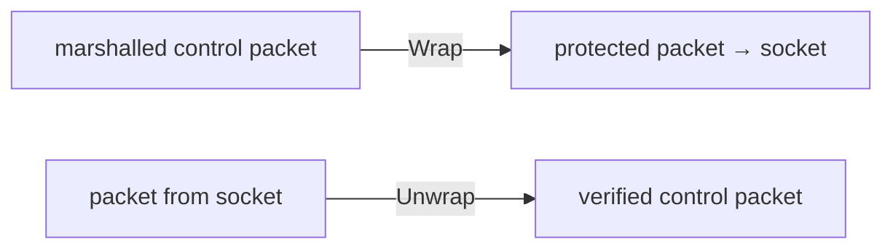

# internal/openvpn/tlswrap

OpenVPN's static-key control-channel protection: `--tls-auth` (an HMAC over every
control packet) and `--tls-crypt` (authenticated *encryption* of every control
packet). Both draw keys from the same 2048-bit static key file and wrap the
reliable control messages [`control`](../control) produces, before they reach the
socket.

## Specification

Wire layouts from OpenVPN's `ssl_pkt.c` (`write_control_auth`, tls-auth) and
`tls_crypt.c`. Every multi-byte field is big-endian.

## Where it sits

A `Wrapper` sits between the marshalled control packet and the wire:

| Mode | What it adds | Purpose |
|------|--------------|---------|
| `none` (nil Wrapper) | nothing | plain profile |
| tls-auth (`NewAuth`) | HMAC over each control packet | authenticate control channel, cheaply drop injected/DoS packets |
| tls-crypt (`NewCrypt`) | AEAD-encrypt each control packet | also *hide* the control channel (e.g. from DPI) |

## API surface

- `StaticKey` / `ParseStaticKey(pem)` — the 2048-bit (`StaticKeyLen = 256`) key file.
- `NewAuth(key, dir, digest)` — HMAC wrapper; `Digest` / `ParseDigest`.
- `NewCrypt(key, dir)` — AEAD wrapper.
- `Wrapper` interface (`Wrap`/`Unwrap`); `Direction` (`Bidirectional`, …);
  `Mode`; `ErrAuth`, `ErrBadKey`.

## Implementation notes & caveats

- **Key direction must match the peer's mirror.** tls-auth/tls-crypt slice the
  static key into directional halves; a client using the wrong `Direction` will
  produce MACs the server rejects (`ErrAuth`). `Bidirectional` uses one shared
  half both ways.
- **A nil `Wrapper` is the plain profile, unchanged** — the control channel passes
  packets straight through, so the same code path serves all three modes.
- tls-crypt protects the control channel only; the **data** channel is still keyed
  by [`keys`](../keys) and protected by [`data`](../data). tls-crypt's value is
  hiding the handshake, not the tunnel payload.
