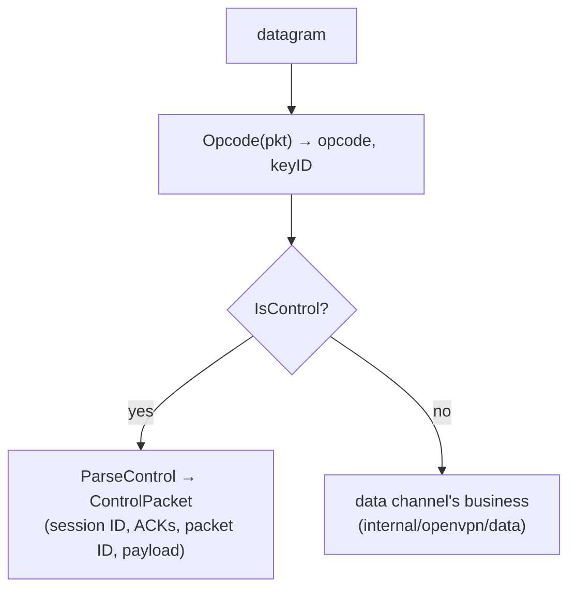

# internal/openvpn/wire

The OpenVPN packet codec: the opcode byte, session IDs, and the control-channel
packet layout (the reliable messages that carry the TLS handshake and key
negotiation). Free of crypto and state, like its WireGuard sibling.

## Specification

Layouts follow OpenVPN's `ssl_pkt.c` and `reliable.c`. **Every multi-byte field is
big-endian** (network byte order), unlike WireGuard's little-endian. This is the
only place that touches raw offsets.

## Two channels, one socket

OpenVPN multiplexes a control channel and a data channel over one UDP socket, told
apart by the opcode in the first byte:

## API surface

- `Opcode(pkt) (opcode, keyID uint8, ok bool)` — the dispatch primitive.
- `IsControl(opcode)` — control vs data.
- `ControlPacket` / `ParseControl(pkt)` — the reliable control layout.
- `SessionID` (`SessionIDLen = 8`), opcode constants
  (`PControlHardResetClientV1`, …), `ErrMalformed`.

## Implementation notes & caveats

- **This package only *extracts* a data packet's opcode for dispatch** — it does
  not decode data packets; that is [`data`](../data)'s job. Keeping the split here
  is what lets one read loop demux both channels.
- **Big-endian everywhere.** All offset math is confined to this file so the
  network-byte-order convention can't leak into the little-endian WireGuard code.
- Parsers are fuzzed and return `ErrMalformed` on short/garbage input rather than
  slicing past the end.
