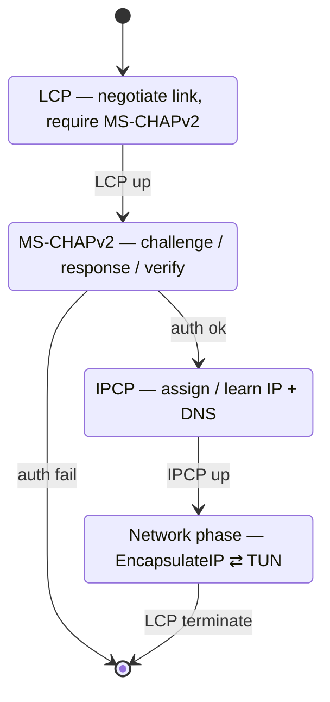

# internal/ppp

A minimal PPP implementation for tunnelling IP over a datagram transport — the link
SSTP carries inside its data packets, and the same engine L2TP and Fortinet drive.
Both roles: the client (`Session`) does link setup and learns its address; the
server (`ServerSession`) is the authenticator and assigns the address.

## Specifications

- [RFC 1661](https://www.rfc-editor.org/rfc/rfc1661) — PPP (framing, LCP, option format).
- [RFC 1332](https://www.rfc-editor.org/rfc/rfc1332) — IPCP (IP address / DNS negotiation).
- [RFC 2759](https://www.rfc-editor.org/rfc/rfc2759) — MS-CHAPv2, via [`internal/mschap`](../mschap).

There is **no async-HDLC layer**: the transport delimits frames, so a frame here is
just the protocol number and its payload.

## Link bring-up state machine

The client and server run mirror images of this: the server opens LCP *requiring*
MS-CHAPv2, challenges and verifies, then assigns the address over IPCP; the client
answers the challenge and receives its address and DNS.

## API surface

- **Client** — `New(username, password, transport, handler) *Session`; `Handler`,
  `IPConfig` (the learned address/DNS).
- **Server** — `NewServer(cfg, transport, handler) *ServerSession`; `ServerConfig`,
  `ServerHandler`, `Authenticator` (`func(username) (password, ok)`).
- **IP glue** — `EncapsulateIP(pkt)`, `IsIP(frame)`, `ProtocolIP = 0x0021`.
- `Transport` — the caller-supplied frame carrier.

## Implementation notes & caveats

- **Transport-neutral by design.** Frames go through a caller-supplied `Transport`,
  which is why one engine serves SSTP (over TLS), L2TP (over IPsec/UDP), and
  Fortinet (over TLS/DTLS) without change. Don't couple it to any one carrier.
- **The server *requires* MS-CHAPv2 in its LCP** — a peer offering only PAP won't
  authenticate against the current server. (xl2tpd's pppd sometimes wants PAP; the
  L2TP plan flags a small additive PAP path if interop needs it.)
- **`IsIP`/`EncapsulateIP` are the only network-phase glue** — everything before
  the Network state is control-protocol negotiation, everything after is raw IP
  in/out of the TUN.
