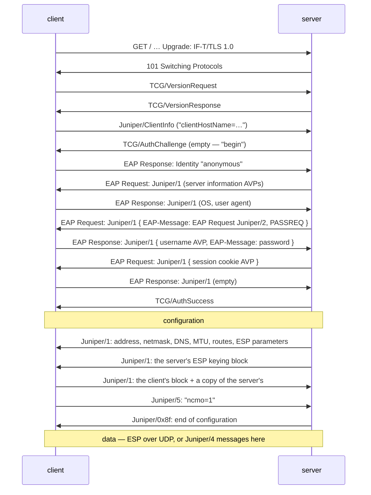

# internal/pulse

Ivanti Connect Secure — formerly Pulse Connect Secure, formerly Juniper: an
**IF-T/TLS** framing layer over ordinary TLS, **EAP inside it** for
authentication, a TLV configuration exchange, and either **RFC 4303 ESP over
UDP** or that same TLS connection for data.

It is the odd one out in this tree twice over. Its authentication is EAP over a
*stream* transport, nested four layers deep; and its ESP keys are pushed by each
end in a fixed-layout binary packet rather than negotiated, with one field — the
SPI — in little-endian.

## Specification

There isn't one. Every offset in this package comes from openconnect's
`pulse.c`, the only implementation of this protocol outside Ivanti's own, and
from the packet dumps its comments preserve. Where openconnect enforces a value,
veepin's server emits exactly that value: it is the peer the interop tests use,
and it is strict.

The pieces that *do* have specifications are used as written: TCG's IF-T
Protocol Bindings for TLS for the 16-octet header, RFC 3748 for EAP, RFC 6733
for the AVP shape (approximately — see below), and RFC 4303 for the data path.

## The exchange

## API surface

- **Framing** — `EncodeMessage`, `EncodeData`, `EncodeLine`, `ParseMessage`,
  `ReadMessage`, `Message`, the `Vendor*` and `Type*` constants, `HeaderLen`.
- **Authentication** — `ClientAuth`, `ServerAuth`, `LoginInfo`, `Authenticator`,
  `ErrAuth`, plus the AVP and EAP codecs (`EncodeAVP`, `ParseAVPs`, `FindAVP`,
  `EncodeEAP`, `EncodeEAPExpanded`, `EncodeEAPResult`, `ParseEAP`).
- **Configuration** — `Config`, `Route`, `BuildConfig`, `ParseConfig`, the
  `Attr*` constants.
- **ESP** — `Keys`, `GenerateKeys`, `BuildESPPacket`, `BuildESPResponse`,
  `ParseESPPacket`, `NewSA`, `NewTunnel`, `Tunnel`, `SecretsLen`,
  `DefaultESPPort`.
- **Roles** — `Connect`, `Client` (with `Probe`), `NewServer`, `Server` (with
  `Serve`, `EnableESP`, `ServeESP`, `RunTUN`).

## Implementation notes & caveats

- **Each ESP keying block names its own *inbound* direction.** The server's block
  is what the client stamps on packets to the server; the client's block is what
  the server stamps on packets back. Wiring both ends the other way round
  produces two SAs that still agree with *each other*, so a veepin↔veepin test
  passes and only a real peer notices. It did, during development;
  `TestKeyBlocksNameTheirOwnInboundDirection` is the guard that followed.
- **The SPI is little-endian.** Nothing else in this protocol is. openconnect's
  comment on the subject reads "I have no idea what made them do this", and
  `TestSPIIsLittleEndian` pins it so a tidy-up cannot quietly correct it.
- **The ESP probe is a single zero octet**, echoed back unchanged. It is not an
  IP packet, so neither end routes it; getting the same octet back is the whole
  liveness proof, and it is what tells a client whether UDP gets through before
  it commits to that path.
- **The AVP length excludes the padding.** Values are padded to a four-octet
  boundary but the length field counts only the header and the value. That is
  not how RFC 6733 reads, and a server that "fixed" it would emit AVPs a real
  client rejects.
- **The configuration packet's four length fields must agree.** A client checks
  the payload length at 0x28, the routing-block length against its own route
  count, and that the attribute block runs exactly to the end. All four are
  built from the buffer's own size here and asserted in `config_test.go`, since
  getting one wrong is refused outright rather than tolerated.
- **Routes are inclusive address ranges, not prefixes.** A network is carried as
  its first and last address; the mask is recovered by XOR. A range that is not
  a prefix produces a non-contiguous mask, which `net.IPNet` represents honestly
  rather than rounding.
- **HMAC-MD5 is refused.** It is one of the three MAC values this protocol can
  name; the other two are implemented. Carrying a broken MAC to be thorough
  would be the wrong trade.
- **No EAP-TTLS, no certificate authentication, no host checker.** A server that
  demands any of them is refused with the reason. Password authentication is
  what deployments use and what openconnect exercises.
- **No rekey.** The server proposes ESP lifetimes but neither end acts on them,
  so a long-lived tunnel keeps its original keys.
- **The IF-T/TLS carrier is TCP.** Running IP over it inherits the usual
  head-of-line blocking, which is why ESP is preferred wherever UDP gets
  through — the same trade AnyConnect makes with DTLS.

## Tests

- `ift_test.go`, `avp_test.go` (in `auth_test.go`), `config_test.go`,
  `esp_test.go` — the four codecs, including every truncation and each of the
  cross-checks a real client makes.
- `auth_test.go` — the whole nested authentication exchange between the two
  roles over an in-memory pipe, and the ways a credential is refused.
- `e2e_test.go` — a client and a gateway over a real TLS listener: both data
  paths, shaped and unshaped, the anti-spoofing rule, and a rejected password.
- `datapath_test.go` — the per-packet allocation guard and the framing
  benchmarks.
- `fuzz_test.go` — five targets over the four codecs.
