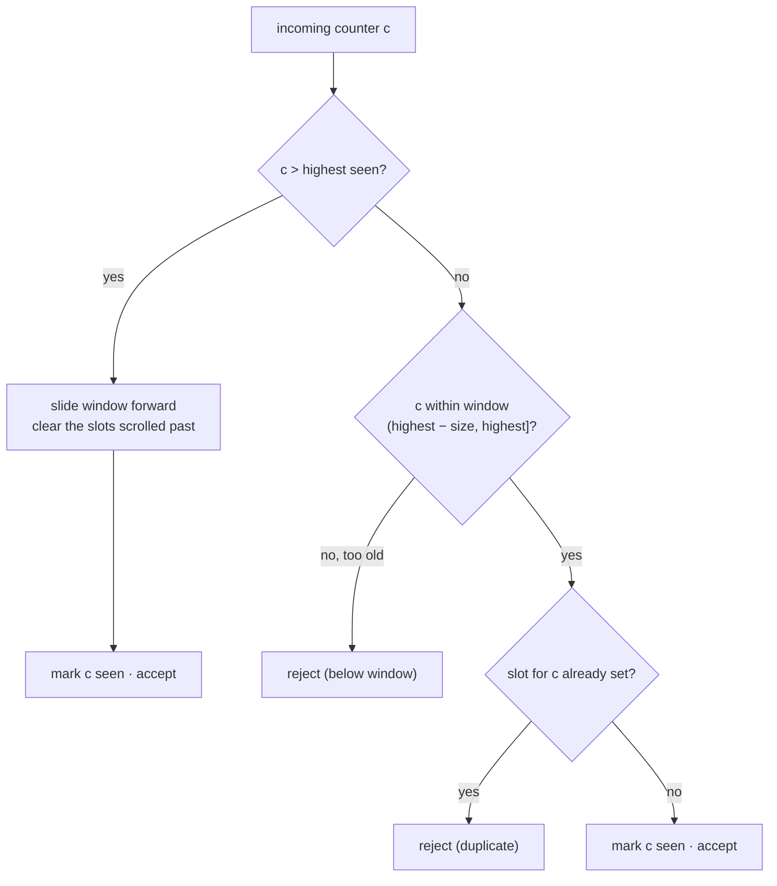

# internal/replay

A sliding-window anti-replay check for protocols whose data path uses a monotonic
counter as **both** the replay identifier and the AEAD nonce.

## Specification

The algorithm is the classic sliding bitmap described normatively for IPsec in
[RFC 4303 §3.4.3 (Sequence Number Verification)](https://www.rfc-editor.org/rfc/rfc4303#section-3.4.3)
and [RFC 6479](https://www.rfc-editor.org/rfc/rfc6479) (an efficient bitmap
variant). This package implements the plain "counter, a window, and nothing else"
form — not RFC 4303's exact sequence handling (see below).

## What it does

`New()` / `NewSize(n)` build a `Window` (default `Size = 1024`). Each received
counter is offered to the window, which reports whether it is fresh (accept and
record) or a replay/too-old (reject).

The subtle step is **clearing the slots the window slides past** when it advances:
get it wrong and you either accept replays or drop legitimate traffic — and no
test notices unless it is specifically looking.

## Why most protocols here do *not* use this

The tree has several look-alike windows — in [`internal/ikev2/esp`](../ikev2/esp),
[`internal/dtls`](../dtls), [`internal/wireguard/transport`](../wireguard/transport),
and two in `internal/openvpn`. They are **deliberately left alone**: they are not
one algorithm wearing different names.

- ESP's window is RFC 4303's, with its mandated size and sequence handling.
- DTLS's is **per-epoch**.
- WireGuard's follows the protocol paper.
- The two OpenVPN variants differ from **each other**.

Each is correct and pinned by an interop cell against a real third-party peer. A
single parameterised abstraction covering all of them would be more complex than
any one of them — trading verified correctness for an aesthetic gain.

This package covers the genuine duplicate: `internal/nebula` and `internal/toy`
had byte-for-byte the same window, written twice.

## When to use it

Adding a protocol whose replay rule is exactly "a counter, a window, and nothing
else"? Use this. If your protocol's spec says something more specific, write that
instead and leave a note saying why — as the packages above do.
