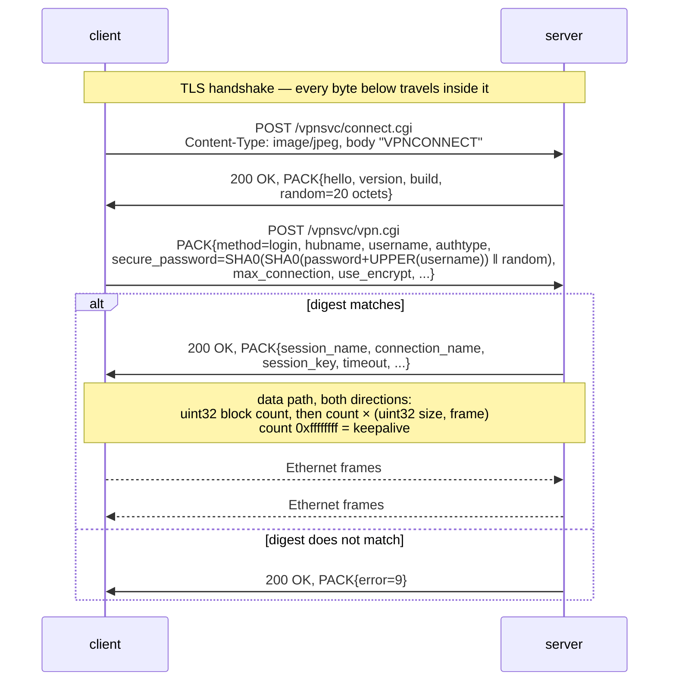

# internal/softether — SoftEther VPN native protocol (SE-VPN)

Ethernet frames over TLS, with the control exchange carried in SoftEther's own
PACK serialisation. This is one of veepin's two **layer-2** protocols — the other
is [`internal/l2tpv3`](../l2tpv3) — where every other protocol here tunnels IP
packets over a TUN device. The switch carries the connected clients *and* the
server's own TAP, which is an ordinary bridge port on it. What it does not do is
bridge that segment onto the host's wider network the way a `brctl`-style
deployment would: the segment ends at the server.

Three things in that diagram are easy to get wrong and each was, until a cell
against the real server said otherwise:

- **The client sends no hello.** Its signature POST is the opening move, and
  the server answers it with the hello unprompted. A server that waits for a
  `PACK{method=hello}` waits forever.
- **Every control message is an HTTP body**, on two different paths — the
  signature goes to `connect.cgi` and everything after it to `vpn.cgi`.
- **`max_connection` in the login is load-bearing.** Omit it and the server
  answers with a perfectly good welcome and then closes the connection before a
  frame moves, which presents as a data-path bug a long way from its cause.

The 20-octet server random is a per-session challenge: the password digest is
bound to it, so a captured login cannot be replayed against a later session.
`hubname` selects the virtual hub. `assigned_ip` is not in this diagram because
a real SoftEther does not send one — the segment is layer 2, and addressing
inside it is DHCP's or the operator's job.

## Shape of the code

- `pack.go` — the PACK codec. A PACK is a set of named, typed, indexed values;
  the encoder and decoder are the only things that touch the wire format. Big-
  endian throughout, with three mutually inconsistent string encodings that are
  each correct — see the package comment.
- `http.go` — the HTTP layer the control PACKs ride on. A connection opens with
  a POST to `/vpnsvc/connect.cgi` and each control message after it is the body
  of an HTTP message on `/vpnsvc/vpn.cgi`.
- `frame.go` — the data path's block framing: a count, then that many
  length-and-body pairs, with `0xffffffff` reserved for keepalives.
- `sha0.go` / `auth.go` — the password construction, and the legacy digest it
  is built on.
- `session.go` — both roles' control exchange and the frame loop.
- `switch.go` — the learning bridge: a MAC-to-port table with ageing, plus the
  flood/forward decision.

## Caveats

State these plainly rather than discovering them later.

- **`Gateway()` and `Network()` are fixed values**, not anything the data path
  derives. They report `10.70.0.1` and `10.70.0.0/24` because that is what the
  server assumes, not because it was configured or negotiated.

  *(The entry that used to sit beside this one — "every client is told
  `10.70.0.2`", with no pool and two clients handed the same address — is
  closed. `Server.assignAddress` allocates sequentially over the gateway's /24
  and releases on teardown. Note that a real SoftEther assigns no address at
  all: the segment is layer 2 and addressing inside it comes from DHCP or
  static configuration, so `assigned_ip` is veepin's own extension for veepin's
  own client and a real server does not send it.)*

  *(The larger gap this entry used to describe — "nothing connects the bridge to
  the host TAP device" — is closed. `local.go` puts the server's own interface on
  the switch as an ordinary bridge port, and the client relays frames between its
  TAP and the TLS session; neither had existed, so every SoftEther tunnel came
  up, authenticated and carried nothing. `TestInteropSoftEtherSelf` is the cell
  that would now catch it.)*
- **Authentication is password-only, and the digest is SHA-0** — the withdrawn
  1993 predecessor of SHA-1, which differs from it by the single missing rotate
  in the message schedule that got SHA-0 withdrawn. That is what the protocol
  specifies and not a choice this implementation gets to make; `sha0.go` carries
  the derivation and the reference's own compiled code as the check. The server
  stores the plaintext password because the challenge response is computed from
  `SHA0(password + UPPER(username))` — there is no verifier form that would let
  it store less. Nothing in the tunnel's confidentiality rests on SHA-0: it
  authenticates a login inside TLS, and a collision against it buys an attacker
  no more than knowing the password would.
- **No UDP acceleration.** SoftEther's data path can move to UDP once the TLS
  session is up. Only the TLS path is implemented, so throughput carries TCP's
  head-of-line blocking.
- **No RADIUS, no certificate authentication, no cascade connections, no
  multi-hub.** One hub, one local account list.
- ~~**No shaping.**~~ Closed: `-shape` pads the IP-bearing frames of the segment
  towards the frame MTU, and the receiver trims by the inner IP header's own
  Total Length. Non-IP frames are left alone — ARP has no length field to trim
  by, and padding one would corrupt the first exchange across a layer-2 segment.
- ~~**The server has no cross-implementation cell.**~~ Closed:
  `compose.softether-server.yml` drives SoftEther's own `vpnclient` against
  veepin's server, and both directions now have a cell against the reference.

  This entry used to name two blockers, and **neither was one** — which is worth
  leaving on the page rather than quietly deleting. `PackWelcome`'s policy is
  not required: `PackGetPolicy` allocates a zeroed `POLICY` and fills it from
  whatever elements are present, so a welcome carrying none parses, and the
  client enforces only `AutoDisconnect` and `NoSavePassword` locally — for both
  of which zero is the permissive value. And the client opens no additional
  connections: `ClientAdditionalConnectChance` compares the live count against
  `MaxConnection`, which is the welcome's own `max_connection`, and this server
  advertises 1.

  What did block it was a layer lower and had not been guessed at. `vpnclient`
  opens the connection with `GET /` and posts the signature **second**;
  `ServerDownloadSignature` is a loop that answers up to nineteen requests
  before the signature arrives. veepin read exactly one request and judged it,
  so every real client was refused on its opening move — and nothing noticed,
  because veepin's own client posts the signature first. See `http.go`.

  The policy is sent now anyway, for a reason that is not compatibility: an
  omitted element gives the peer the value we wanted by accident rather than by
  statement. `policy.go` carries that argument in full.

## Tests

- `pack_test.go` — the PACK codec, including a rejection for every truncation of
  a valid message.
- `switch_test.go` — the bridge: learning, ageing, flooding, and the eviction
  path when the table is full.
- `e2e_test.go` — a real TLS listener with both roles: a frame crossing between
  two clients, and the four ways a login must be refused (wrong password,
  unknown user, no credentials configured, and a challenge that is never
  reused).
- `sha0_test.go` — the published SHA-0 vectors, and a guard that the digest is
  not SHA-1. Swapping in `crypto/sha1` compiles, passes every self-test, and is
  rejected by every real server.
- `auth_test.go` — the password construction: the case fold, the concatenation
  order, and that the challenge is concatenated rather than XORed. All three
  are self-consistent when wrong.
- `frame_test.go` — the block framing, including that a keepalive is not
  surfaced as a frame and a zero count is a tick rather than an empty one.
- `local_test.go` — the server's own interface as a switch port: a client's
  frame reaching it, its own frames not being echoed back, its MAC being
  learned, and detaching taking it off the switch.
- `policy_test.go` — the session policy: that the element names carry the
  `policy:` prefix the reference reads, that every restriction flag is false
  because this server enforces none of them, that the policy's timeout is
  seconds where the welcome's is milliseconds, and that an absent policy is
  distinguishable from one that grants no access — which the wire cannot say and
  a reader acting on `Access` alone would get wrong.
- `http_test.go` — the opening exchange: that the signature need not be the
  first request (the bug the `vpnclient` cell found), that it still works when
  it is, that a peer which never signs is cut off, and that the 403 page escapes
  the peer-supplied target it reflects.
- `fuzz_test.go` — the PACK decoder.
