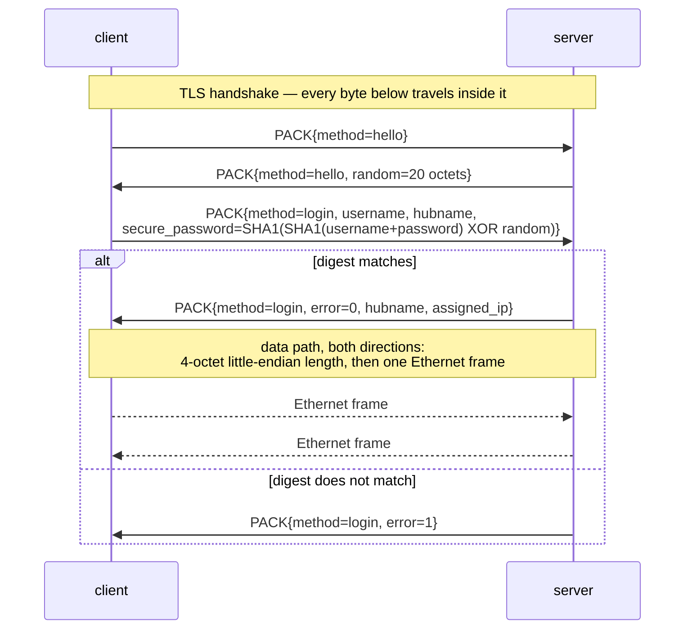

# internal/softether — SoftEther VPN native protocol (SE-VPN)

Ethernet frames over TLS, with the control exchange carried in SoftEther's own
PACK serialisation. This is one of veepin's two **layer-2** protocols — the other
is [`internal/l2tpv3`](../l2tpv3) — where every other protocol here tunnels IP
packets over a TUN device. SoftEther switches Ethernet frames between connected
clients rather than bridging them to a host TAP, which is the gap the caveats
below name: L2TPv3 is the one with a working TAP data path.

The 20-octet server random is a per-session challenge: the password digest is
bound to it, so a captured login cannot be replayed against a later session.
`hubname` selects the virtual hub and is echoed back on success.

## Shape of the code

- `pack.go` — the PACK codec. A PACK is a set of named, typed, indexed values;
  the encoder and decoder are the only things that touch the wire format.
- `session.go` — both roles' control exchange and the frame loop.
- `switch.go` — the learning bridge: a MAC-to-port table with ageing, plus the
  flood/forward decision.

## Caveats

State these plainly rather than discovering them later.

- **No TAP data path.** The server switches frames between connected *clients*,
  and `internal/softether` is tested for exactly that. Nothing yet connects the
  bridge to the host TAP device, so traffic cannot reach or leave the host, and
  `Gateway()`/`Network()` return fixed values rather than anything the data path
  honours. This is the largest gap and it is why the interop matrix carries `—‡`
  rather than a result.
- **Address assignment is a constant.** Every client is told `10.70.0.2`. There
  is no pool, no lease, and two clients are given the same address.
- **Authentication is password-only, and the digest is SHA-1.** That is what the
  protocol specifies; it is not a choice this implementation gets to make. The
  server stores the plaintext password because the challenge response is
  computed from `SHA1(username+password)` — there is no verifier form that would
  let it store less.
- **No UDP acceleration.** SoftEther's data path can move to UDP once the TLS
  session is up. Only the TLS path is implemented, so throughput carries TCP's
  head-of-line blocking.
- **No RADIUS, no certificate authentication, no cascade connections, no
  multi-hub.** One hub, one local account list.
- **No shaping.** Every other protocol here honours `dataplane.Shaper`; this one
  does not yet.

## Tests

- `pack_test.go` — the PACK codec, including a rejection for every truncation of
  a valid message.
- `switch_test.go` — the bridge: learning, ageing, flooding, and the eviction
  path when the table is full.
- `e2e_test.go` — a real TLS listener with both roles: a frame crossing between
  two clients, and the four ways a login must be refused (wrong password,
  unknown user, no credentials configured, and a challenge that is never
  reused).
- `fuzz_test.go` — the PACK decoder.
