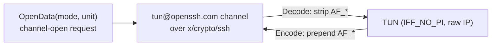

# internal/sshtun

Wire glue for OpenSSH's layer-3 tunnel forwarding — the `tun@openssh.com` channel
that `ssh -w` opens and `sshd` accepts under `PermitTunnel`. Transport-agnostic: it
only encodes the channel-open request and frames IP packets, so both the veepin
client and server drive it over `golang.org/x/crypto/ssh`.

## Specification

- [OpenSSH PROTOCOL](https://github.com/openssh/openssh-portable/blob/master/PROTOCOL), the `tun@openssh.com` section.

## Framing

The channel carries IP packets each prefixed with a **4-octet address family** in
network byte order:

veepin's TUN is opened `IFF_NO_PI` (raw IP, no packet-info header), so `Encode`
prepends the family and `Decode` strips it. The family values are the Linux `AF_*`
numbers — what OpenSSH on Linux puts on the wire.

## API surface

- `OpenData(mode, unit) []byte` / `ParseOpenData(b)` — the channel-open payload;
  `ModePointToPoint`, `ChannelType`, `TunIDAny`.
- `Encode(ipPacket) []byte` / `Decode(frame) (ipPacket, ok)` — the AF prefix.
- `ReadPacket(r)` — one framed packet off a stream; `ErrMalformed`.

## Implementation notes & caveats

- **The AF prefix is the whole framing.** There is no length field inside the
  channel — SSH channel messages already delimit — so `Decode` just validates and
  strips the 4-byte family. A frame shorter than the prefix is `ErrMalformed`.
- **`AF_*` values are Linux's**, because interop is against Linux `sshd`/`ssh`. On
  another OS OpenSSH would use different family numbers; that portability is out of
  scope here.
- **Server-side `sshd` binds a *pre-created* tun device**, so the client must
  request that unit; the veepin server assigns the unit itself. This asymmetry is
  handled by the caller passing the right `unit` to `OpenData` (see the interop
  matrix note in the root README).
