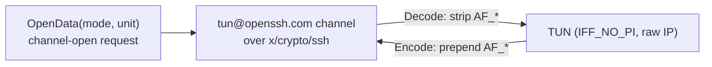

# internal/sshtun

Wire glue for OpenSSH's layer-3 tunnel forwarding — the `tun@openssh.com` channel
that `ssh -w` opens and `sshd` accepts under `PermitTunnel`. Transport-agnostic: it
only encodes the channel-open request and frames IP packets, so both the veepin
client and server drive it over `golang.org/x/crypto/ssh`.

## Specification

- [OpenSSH PROTOCOL](https://github.com/openssh/openssh-portable/blob/master/PROTOCOL), the `tun@openssh.com` section.

## Framing

The channel carries IP packets each prefixed with a **4-octet address family** in
network byte order:

```mermaid
flowchart LR
    OPEN["OpenData(mode, unit)<br/>channel-open request"] --> CH["tun@openssh.com channel<br/>over x/crypto/ssh"]
    TUN["TUN (IFF_NO_PI, raw IP)"] -->|Encode: prepend AF_*| CH
    CH -->|Decode: strip AF_*| TUN
```

veepin's TUN is opened `IFF_NO_PI` (raw IP, no packet-info header), so `Encode`
prepends the family and `Decode` strips it. The family values are the Linux `AF_*`
numbers — what OpenSSH on Linux puts on the wire.

## API surface

- `OpenData(mode, unit) []byte` / `ParseOpenData(b)` — the channel-open payload;
  `ModePointToPoint`, `ChannelType`, `TunIDAny`.
- `Encode(ipPacket) []byte` / `Decode(frame) (ipPacket, ok)` — the AF prefix.
- `ReadPacket(r)` — one framed packet off a stream; `ErrMalformed`.

## Implementation notes & caveats

- **The AF prefix is the whole framing.** There is no length field inside the
  channel — SSH channel messages already delimit — so `Decode` just validates and
  strips the 4-byte family. A frame shorter than the prefix is `ErrMalformed`.
- **`AF_*` values are Linux's**, because interop is against Linux `sshd`/`ssh`. On
  another OS OpenSSH would use different family numbers; that portability is out of
  scope here.
- **Server-side `sshd` binds a *pre-created* tun device**, so the client must
  request that unit; the veepin server assigns the unit itself. This asymmetry is
  handled by the caller passing the right `unit` to `OpenData` (see the interop
  matrix note in the root README).

## Shaping and the byte stream

Trailing filler is what shapes an SSH tunnel, and getting it onto a byte stream
took a framing property rather than a padding call.

There is no length field inside the channel and SSH channel messages do not
survive as boundaries through `x/crypto/ssh` — `ssh.Channel` is an `io.Reader`,
not a datagram source — so `ReadPacket` recovers packet boundaries from the IP
header's own length. Filler after a packet would therefore be read as the *next*
packet's address-family header, and the stream would desynchronise from that
point on. The symptom is a corrupt tunnel rather than a padding bug, and it only
appears on the second packet.

The header is `00 00 00 02` (AF_INET) or `00 00 00 0a` (AF_INET6), so **a whole
zero word can only be filler**. `ReadPacket` reads 4-octet words and discards
the zero ones; the unshaped case still costs exactly one read, which is every
existing deployment and every stock OpenSSH peer. `EncodePadded` therefore pads
by whole words, rounding *down* — the shaper's target is an MTU, and overshooting
it is the one direction that costs something.

A stock OpenSSH peer needs none of this. It writes each channel message to its
tun device in one call, and the kernel's IP stack delimits the real packet by
Total Length, so the filler is never seen above IP.
`compose.ssh-server-shaped.yml` is what turned that from an argument into
evidence — and the final frame's filler trailing until the next read is correct
rather than a leak, which `TestFillerIsSkippedAndTheStreamStaysInSync` states
explicitly so nobody "fixes" it.
