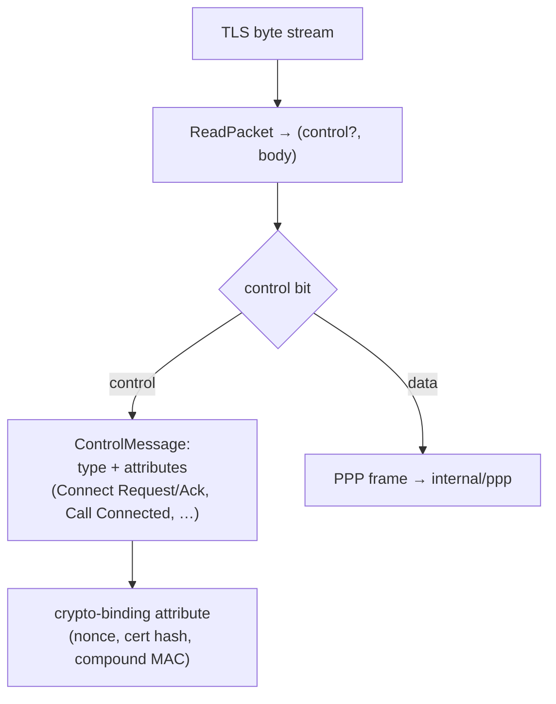

# internal/sstp/wire

The SSTP packet codec: the 4-octet packet header that tells control packets from
data packets, the control-message framing (message type + attribute list), and the
crypto-binding attribute layouts the handshake exchanges.

## Specification

- [[MS-SSTP]](https://learn.microsoft.com/en-us/openspecs/windows_protocols/ms-sstp/) — Secure Socket Tunneling Protocol.

SSTP runs over a **TLS byte stream**, so packets are length-delimited rather than
datagram-framed: every packet header carries its total length, and `ReadPacket`
pulls exactly one packet off the stream. Every multi-byte field is big-endian.

## Packet families

## API surface

- `ReadPacket(r) (control bool, body []byte, err error)` — one packet off a stream.
- `EncodeControl(msgType, attrs)`, `EncodeData(payload)`.
- `ControlMessage` / `ParseControl(body)`, `Attribute`.
- Message-type constants (`MsgCallConnectRequest`, …), attribute/status constants
  (`AttrNoError`, `CertHashSHA1`, …), `NonceLen = 32`, `HeaderLen = 4`,
  `ProtocolPPP`, `Version = 0x10`, `ErrMalformed`.

## Implementation notes & caveats

- **Length-delimited, not datagram-framed.** `ReadPacket` trusts the header length
  to pull one packet; a truncated stream yields `ErrMalformed` rather than a
  partial packet. Callers must read packets, not raw bytes.
- **The crypto-binding attribute is the security-critical one** — it ties the PPP
  authentication (via [`internal/mschap`](../../mschap)'s HLAK) to the TLS channel,
  so SSTP's MS-CHAPv2 is not an unauthenticated tunnel even with a self-signed cert.
  This package only lays the attribute out; the binding computation lives above.
- Data packets carry PPP frames handed to [`internal/ppp`](../../ppp).
