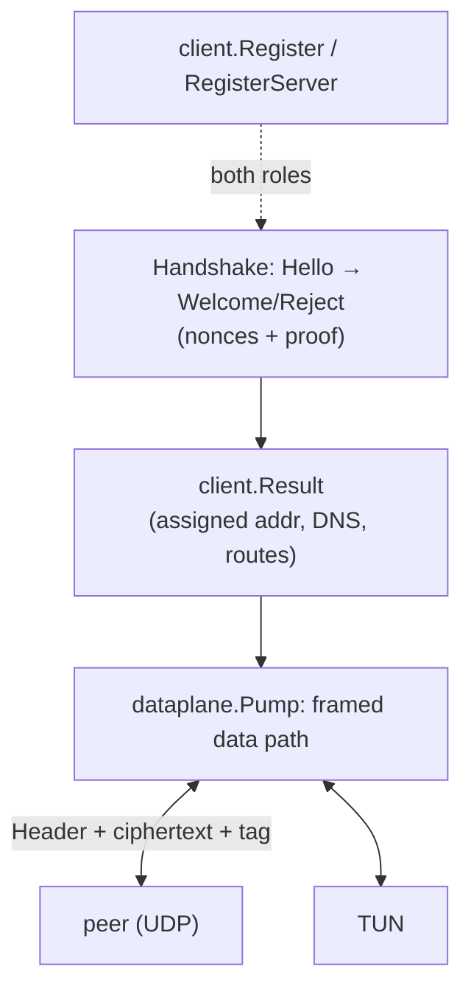

# internal/toy

TOY, a **teaching** protocol. It exists so the *shape* of a veepin protocol can be
read in one sitting: a handshake that produces a `client.Result`, a framed data
path built on `dataplane.Pump`, and both roles registered with the client registry.

> **TOY PROVIDES NO SECURITY.** Its cryptography is deliberately worthless — a
> repeating-XOR keystream and a non-cryptographic hash. If you are adding a real
> protocol, copy the **structure**, not the cryptography.

## Specification

The full wire format is in [`SPEC.md`](./SPEC.md) alongside the code, written to be
reimplementable — the interop harness proves it by talking to an independent Python
implementation of that document. `SPEC.md` also sets out exactly how and why TOY's
crypto fails.

## Shape of a veepin protocol

## API surface (the reusable pattern)

- **Handshake** — `Handshake(ctx, conn, ClientConfig) (*Session, Welcome, error)`;
  `Hello`/`Welcome`/`Reject` with `Append*` encoders; `CheckProof`.
- **Framing** — `Header`/`AppendHeader`, `Overhead`, `HeaderLen`, `TagLen`;
  `CheckTag`; `ErrBadTag`, `ErrNotTOY`.
- **Lifecycle** — `KeepaliveInterval`, `SessionTimeout`.

## Implementation notes & caveats

- **This is the smallest complete example** to copy a new protocol's structure
  from — registry wiring, handshake → `Result`, pump-based data path — precisely
  because nothing here is load-bearing security.
- **The anti-replay window is the shared [`internal/replay`](../replay)**, since
  TOY's rule is exactly "a counter and a window". TOY and [`nebula`](../nebula)
  were the byte-for-byte duplicate that motivated extracting that package.
- **Never carry real traffic over TOY.** The XOR keystream and non-crypto hash mean
  a passive observer recovers the plaintext; it is a demonstration of *plumbing*,
  not confidentiality.
