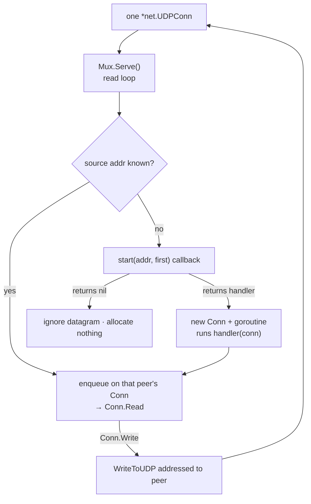

# internal/udpmux

Turns one bound UDP socket into many per-peer `net.Conn`s. Shared by every
datagram-carried protocol that serves multiple clients on a single socket —
AnyConnect's DTLS channel and Fortinet's, today.

## The problem it solves

A single bound socket serves every client, so an inbound datagram must be routed
to the right session **before any key exists to authenticate it**. Routing by
source address is all that is available that early — and it is enough: the session
above still has to complete a handshake, so a forged source address gets an
attacker no further than a handshake they cannot finish.

## Model

The `start` callback is the **only** thing that can allocate a session. It
inspects the first datagram and either declines (returns `nil` — nothing is
allocated, defeating source-spoofed floods) or returns the `func(*Conn)` handler
to run in its own goroutine for that new peer.

## API surface

- `New(conn *net.UDPConn, maxSize int, start func(addr *net.UDPAddr, first []byte) func(*Conn)) *Mux`
  — `maxSize` bounds a received datagram; `start` is the admission hook above.
- `Mux`: `Serve()` (the read loop), `Drop(*Conn)` (forget a peer), `Close()`,
  `Socket()`.
- `Conn` — a `net.Conn` for one peer: reads dequeue from the demux queue, writes
  go straight out addressed to that peer. Full deadline support; `ErrTimeout` is
  the read-deadline error.

## Implementation notes & caveats

- **Admission-by-callback, not by table.** The mux never allocates for an unknown
  peer on its own; the protocol above decides via `start`. This keeps the
  spoofing-resistance policy in the protocol that understands its own first
  message (e.g. "only a DTLS ClientHello may open a session").
- **One goroutine per peer** runs the returned handler; the single read loop only
  demuxes and enqueues, so a slow peer handler cannot stall the socket beyond its
  own queue.
- **`Drop` is how a session is reclaimed** — the handler calls it (directly or via
  `Conn.Close`) when the peer is gone, so a new datagram from that address is
  treated as a fresh peer rather than delivered to a dead queue.
- Source-address routing is a *pre-authentication* convenience only; it grants no
  trust. All security still rests on the handshake the session runs over the
  returned `Conn`.
