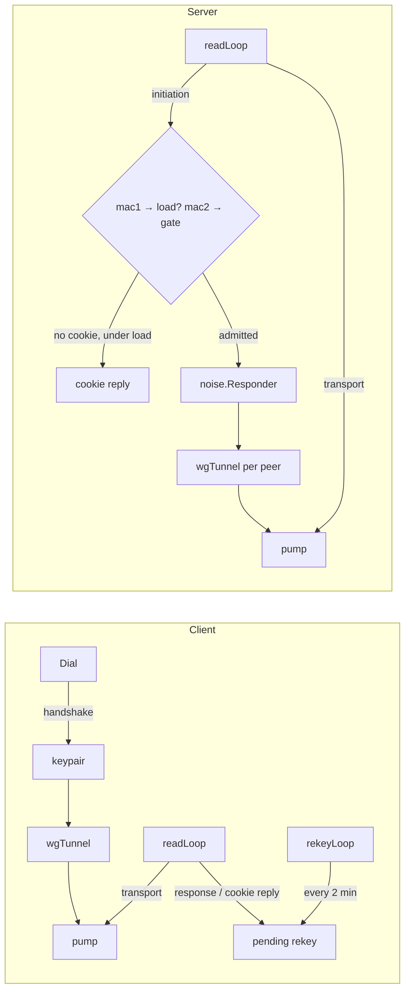

# internal/wireguard

The WireGuard engine: the client session, the multi-peer server, and the
AmneziaWG wire transform both can carry. The public [`wireguard`](../../wireguard)
package parses options and wg-quick files and hands this package decoded
configuration; nothing here reads text. Beneath it are
[`wire`](wire) (the message codec), [`noise`](noise) (the handshake and the
cookie exchange) and [`transport`](transport) (the data-path AEAD).

## Specification

- [WireGuard protocol paper](https://www.wireguard.com/papers/wireguard.pdf) —
  §5.4 for the messages, §6 for the timers this package runs.
- AmneziaWG has no specification beyond
  [amneziawg-go](https://github.com/amnezia-vpn/amneziawg-go), against which
  veepin interoperates.

## The two roles

## API surface

- `Dial(ctx, ClientConfig) (*Session, error)` — the initiator. `*Session` is a
  `client.Session`, `client.Prober` and `client.LivenessTuner`; a handshake the
  peer's keys refused comes back as `noise.ErrDecrypt` itself, for the caller to
  report as an authentication failure.
- `NewServer(ServerConfig) (*Server, error)` — opens the TUN, binds nothing;
  `ListenAndServe` binds. `Peers`, `Gateway`/`Network` and their v6 twins, `MTU`,
  `Close`, `Abandon`.
- `ObfuscationConfig` — AmneziaWG's H1–H4, S1–S4 and junk; the zero value is
  stock WireGuard, byte for byte.
- `RekeyAfterTime`, `DefaultCookieThreshold`.

## Implementation notes & caveats

- **Roaming follows authentication only.** A server peer's address moves when a
  transport packet from a new source *opens* — the pump calls `SetPeerAddr`
  after `Decapsulate` succeeds — and on a completed handshake. A datagram that
  merely carries the peer's receiver index, which is cleartext, moves nothing.
- **Both data-path directions allocate nothing.** `wgTunnel` implements
  `dataplane.AppendTunnel`, so the pump seals into its own reused buffer, and
  `transport.Session.Open` decrypts in place.
- **The server's load is a rate, not a queue.** wireguard-go is under load when
  128 initiations are *queued*; this server handles initiations on its read loop
  and has no queue, so it counts them instead, over one-second windows, with
  wireguard-go's one second of hysteresis. `-cookie-threshold` tunes it.
- **A cookie retry goes at once.** wireguard-go waits for its retransmit timer;
  nothing in the protocol asks for that, and it would cost every client five
  seconds per handshake while a server is busy. Each reply is bound to one
  initiation's mac1, so it can prompt at most one retry, and a reply that does
  not authenticate prompts none.
- **Rekey is the client's.** The server answers initiations and never starts
  one, so a peer that never rekeys (a client that is not veepin's and is idle)
  reaches the key's rejection age and stops; its next packet re-handshakes.
- **A cookie reply sent *to* the server is ignored.** The protocol lets an
  initiator that is itself under load answer a handshake *response* with a
  cookie reply; this server drops it, and its responses carry no mac2, so such a
  client would keep refusing them until its own load fell. That takes a client
  both loaded and dialling a veepin server, and nothing veepin ships sends one.
- **AmneziaWG's MACs cover the substituted type word**, at both ends, mac2
  included. Computing them over the stock word is invisible between two veepin
  endpoints and refused by amneziawg-go.

## Tests

The handshake, roaming, rekey and cookie paths are exercised over real loopback
UDP sockets and a pump over a discarding device, so none of them needs a TUN.
The cross-implementation evidence is in the interop matrix: wireguard-go in both
directions, padded and IPv6, a recorded corpus, and `compose.wireguard-server-cookie.yml`,
where a stock client has to get through the server's cookie challenge.
