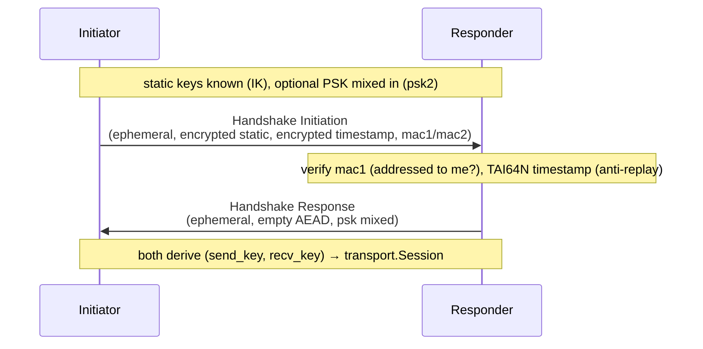

# internal/wireguard/noise

WireGuard's `Noise_IKpsk2` handshake. A **fixed** sequence of DH operations, KDF
steps and AEAD calls — WireGuard has no cipher suites and no negotiation — so the
code reads as a line-by-line transcription of the protocol paper rather than a
state machine with choices.

## Specifications

- [WireGuard protocol paper](https://www.wireguard.com/papers/wireguard.pdf) §5.4.2/§5.4.3 (handshake), §5.4.4 (cookie/MAC).
- [Noise Protocol Framework](https://noiseprotocol.org/noise.html) — the `IKpsk2` pattern.
- Primitives: Curve25519 ([RFC 7748](https://www.rfc-editor.org/rfc/rfc7748)), ChaCha20-Poly1305 ([RFC 8439](https://www.rfc-editor.org/rfc/rfc8439)), BLAKE2s ([RFC 7693](https://www.rfc-editor.org/rfc/rfc7693)).

## Handshake

Two messages complete the handshake; both derive the same pair of transport keys
handed to [`transport`](../transport):

## API surface

- `NewInitiator(Config) (*Initiator, error)` — veepin's dial-out role.
- `NewResponder(localStatic) (*Responder, error)` — the mirror role.
- `PublicKey(private) ([KeySize]byte, error)`, `Keypair` (the derived transport keys).
- Errors: `ErrDecrypt` (handshake AEAD failure), `ErrMAC1` (initiation not
  addressed to this responder).

## Implementation notes & caveats

- **This is a transcription; check it against the paper, not against intuition.**
  Every step's comment names the paper line it implements. The only way to be sure
  it is right is line-by-line comparison — treat the comments as the spec anchors
  they are and do not "simplify" a step without re-deriving it.
- **`mac1` is an addressing check, not authentication** — it lets a responder
  cheaply reject initiations not meant for it (`ErrMAC1`). Real authentication is
  the encrypted-static/timestamp AEAD.
- **The timestamp is TAI64N and anti-replay-relevant**: a responder rejects an
  initiation whose timestamp is not strictly newer than the last it accepted from
  that peer.
- **Under-load / cookie (`mac2`) handling is minimal.** The full responder DoS
  mitigation (cookie replies under load) is the paper's §5.4.7; this
  implementation covers the common path. Related but distinct: Nebula uses a
  *different* Noise pattern (plain `IX`) — see [`internal/nebula`](../../nebula),
  don't assume the two share handshake code.
