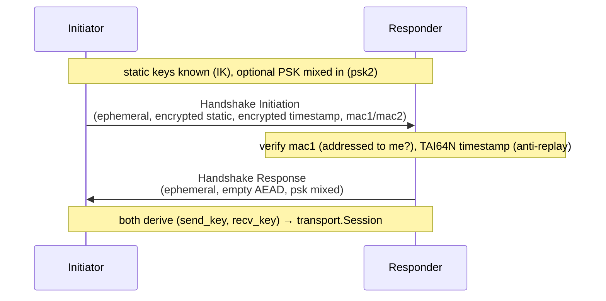
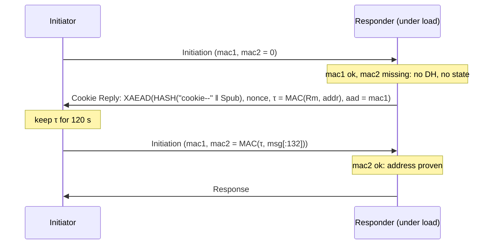

# internal/wireguard/noise

WireGuard's `Noise_IKpsk2` handshake. A **fixed** sequence of DH operations, KDF
steps and AEAD calls — WireGuard has no cipher suites and no negotiation — so the
code reads as a line-by-line transcription of the protocol paper rather than a
state machine with choices.

## Specifications

- [WireGuard protocol paper](https://www.wireguard.com/papers/wireguard.pdf) §5.4.2/§5.4.3 (handshake), §5.4.4 (MACs), §5.3 and §5.4.7 (cookies under load).
- [Noise Protocol Framework](https://noiseprotocol.org/noise.html) — the `IKpsk2` pattern.
- Primitives: Curve25519 ([RFC 7748](https://www.rfc-editor.org/rfc/rfc7748)), ChaCha20-Poly1305 ([RFC 8439](https://www.rfc-editor.org/rfc/rfc8439)), BLAKE2s ([RFC 7693](https://www.rfc-editor.org/rfc/rfc7693)).

## Handshake

Two messages complete the handshake; both derive the same pair of transport keys
handed to [`transport`](../transport):

```mermaid
sequenceDiagram
    participant I as Initiator
    participant R as Responder
    Note over I,R: static keys known (IK), optional PSK mixed in (psk2)
    I->>R: Handshake Initiation<br/>(ephemeral, encrypted static, encrypted timestamp, mac1/mac2)
    Note over R: verify mac1 (addressed to me?), TAI64N timestamp (anti-replay)
    R->>I: Handshake Response<br/>(ephemeral, empty AEAD, psk mixed)
    Note over I,R: both derive (send_key, recv_key) → transport.Session
```

## Under load

A responder that is busy stops spending Diffie-Hellman on initiations whose
source it cannot vouch for, and sends a cookie reply instead — `cookie.go`:

```mermaid
sequenceDiagram
    participant I as Initiator
    participant R as Responder (under load)
    I->>R: Initiation (mac1, mac2 = 0)
    Note over R: mac1 ok, mac2 missing: no DH, no state
    R->>I: Cookie Reply: XAEAD(HASH("cookie--" ‖ Spub), nonce, τ = MAC(Rm, addr), aad = mac1)
    Note over I: keep τ for 120 s
    I->>R: Initiation (mac1, mac2 = MAC(τ, msg[:132]))
    Note over R: mac2 ok: address proven
    R->>I: Response
```

`Rm` rotates every two minutes and is never stored per peer, so answering a
flood costs one keyed hash and one AEAD seal per datagram and no memory.

## API surface

- `NewInitiator(Config) (*Initiator, error)` — veepin's dial-out role.
- `NewResponder(localStatic) (*Responder, error)` — the mirror role.
- `PublicKey(private) ([KeySize]byte, error)`, `Keypair` (the derived transport keys).
- `NewCookieChecker(localStatic, h1)` — the responder's `CheckMAC1`,
  `CheckMAC2(msg, src)` and `CookieReply(msg, src)`. `Initiator.SetCookie` and
  `Initiator.ConsumeCookieReply` are the other half. When the server is under
  load is the caller's decision, not this package's.
- Errors: `ErrDecrypt` (handshake AEAD failure), `ErrMAC1` (initiation not
  addressed to this responder), `ErrCookieReply` (a cookie reply that does not
  authenticate).

## Implementation notes & caveats

- **This is a transcription; check it against the paper, not against intuition.**
  Every step's comment names the paper line it implements. The only way to be sure
  it is right is line-by-line comparison — treat the comments as the spec anchors
  they are and do not "simplify" a step without re-deriving it.
- **`mac1` is an addressing check, not authentication** — it lets a responder
  cheaply reject initiations not meant for it (`ErrMAC1`). Real authentication is
  the encrypted-static/timestamp AEAD.
- **The timestamp is TAI64N and anti-replay-relevant**: a responder rejects an
  initiation whose timestamp is not strictly newer than the last it accepted from
  that peer.
- **The cookie tests are written from wireguard-go's side.** Both halves of the
  exchange live here, so a wrong label or AAD would agree with itself and with
  nothing else; `cookie_test.go` recomputes what wireguard-go computes straight
  from `x/crypto` and holds this package to it, and the `wireguard-cookie`
  interop cell makes stock wireguard-go go through a veepin server's challenge.
- **The cookie's address encoding is local.** τ is `MAC(Rm, address ‖ port)`,
  and only the responder that issued it ever recomputes it, so the encoding (the
  address in its own family, the port big-endian) is not an interop surface.
- **A responder never answers a cookie reply of its own.** The protocol lets an
  *initiator* under load send one in reply to a handshake response; this
  responder would then retry without mac2 on its response, since `Response`
  leaves mac2 zero. It would take a client both loaded and dialling this server
  to matter, and nothing veepin ships sends one.
- Related but distinct: Nebula uses a *different* Noise pattern (plain `IX`) —
  see [`internal/nebula`](../../nebula), don't assume the two share handshake
  code.
