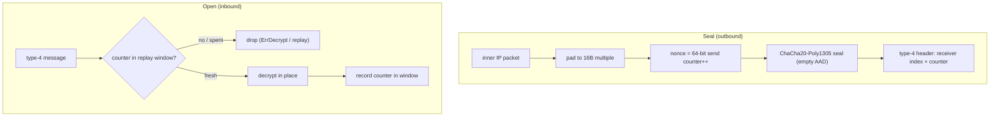

# internal/wireguard/transport

WireGuard's data path: it turns the directional keys a completed
[`noise`](../noise) handshake yields into type-4 transport messages and back. This
is where the handshake stops and steady-state traffic begins — and it is one of
the tree's allocation-guarded hot paths.

## Specification

- [WireGuard protocol paper](https://www.wireguard.com/papers/wireguard.pdf) §5.4.6 (transport data), §5.4.6 anti-replay.
- ChaCha20-Poly1305 ([RFC 8439](https://www.rfc-editor.org/rfc/rfc8439)).

## Data path

A `Session` holds one keypair (a sending key and a receiving key) plus the two
counters that keep the nonce unique: an outbound counter that increments per
packet, and an inbound anti-replay window.

## API surface

- `NewSession(sendKey, recvKey [KeySize]byte, local, remote uint32) (*Session, error)`
  — build a session from the handshake's directional keys and index pair.
- `Session` seal/open methods; `RejectAfterMessages` (the counter ceiling that
  forces a rekey); `ErrDecrypt`.

## Implementation notes & caveats

- **Fixed construction, no negotiation, no state machine here.** Rekeying is the
  handshake's business — a fresh handshake simply produces a fresh `Session`.
  `RejectAfterMessages` is the point at which the session must be replaced.
- **Allocation profile (guarded by `TestDataPathAllocations`):** Seal is a
  *single* allocation (the returned packet, with padding and nonce folded into
  it); Open is *zero* — it decrypts in place. ~1.9 GB/s at 1400 B, on par with the
  AES-GCM ESP path.
- **The nonce is built in the output buffer, not a stack array.** Passing a 12-byte
  stack nonce through `cipher.AEAD`'s `[]byte` parameter escapes it to the heap.
  Seal writes the nonce into unused tail bytes of the packet it already allocates
  (no shared scratch, so Seal stays safe to call concurrently with keepalives);
  Open reuses the packet's own header bytes as the nonce — the counter already
  sits where the nonce needs it, and the demuxed receiver index is zeroed to
  supply the four leading zeros.
- **The replay window is WireGuard's own** (per the paper), not the shared
  [`internal/replay`](../../replay) — pinned by the wireguard-go interop cell.
