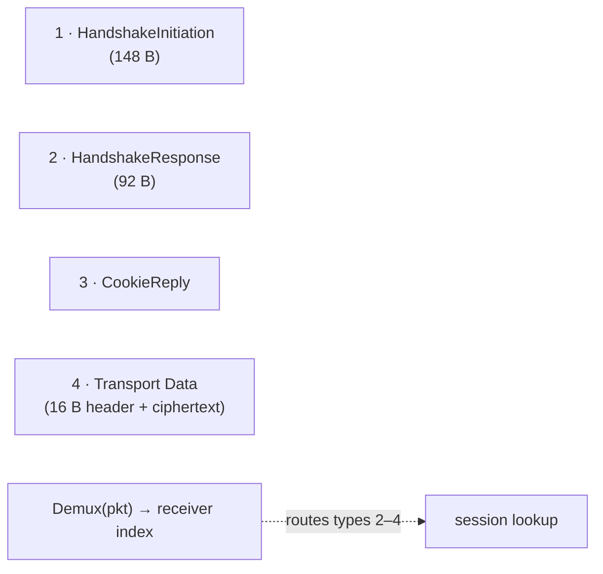

# internal/wireguard/wire

The WireGuard message codec: the four message types, their fixed layouts, and the
demux extractor the data-plane pump needs. Deliberately free of crypto and state —
[`noise`](../noise) computes the field values, this package just lays them out.

## Specification

Layouts are from the [WireGuard protocol paper](https://www.wireguard.com/papers/wireguard.pdf)
§5.4. **Every field is little-endian** — unlike IKEv2's network byte order.

## Message types

## API surface

- **Parse** — `ParseHandshakeInitiation`, `ParseHandshakeResponse`,
  `ParseCookieReply`; `Type(pkt)` for the leading type byte; `ErrMalformed`.
- **Demux** — `Demux(pkt) (uint32, bool)` extracts the receiver index the pump
  keys sessions on; `TransportCounter`, `PutTransportHeader`.
- **MAC / cookie** — `MACRegions(msg)` returns the byte spans mac1/mac2 cover.
- **Timestamp** — `Timestamp(t)` (TAI64N) and `After(a, b)` for the handshake's
  anti-replay timestamp comparison.
- **Constants** — `TypeHandshakeInitiation`/…, fixed sizes
  (`SizeHandshakeInitiation = 148`, …), `KeySize = 32`, `TagLen = 16`,
  `TransportHeaderLen = 16`, `Overhead`.

## Implementation notes & caveats

- **Little-endian, and this is the *only* place that touches raw offsets.**
  Mixing up byte order against IKEv2's big-endian conventions is a classic bug, so
  all offset arithmetic is confined here and tested against fixtures — build a
  message by filling fields, not by writing bytes elsewhere.
- **No crypto, no state** by design: the wire format can be tested without a
  handshake, and the handshake without a socket. Keep it that way.
- **`Demux` is the pump's fast key.** It must succeed on types 2–4 without
  parsing the whole message; a malformed short packet returns `false` rather than
  panicking (fuzzed).
